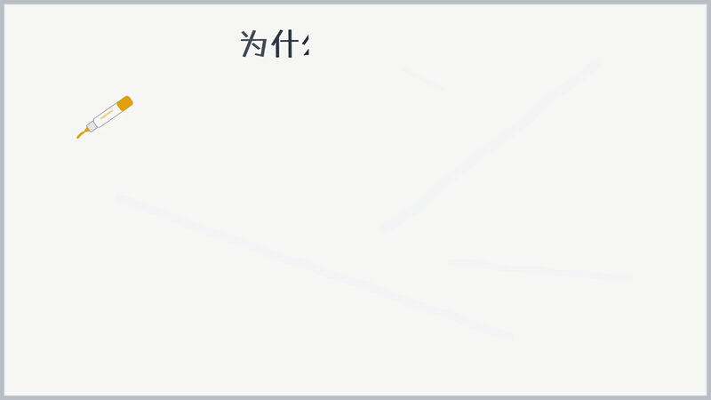
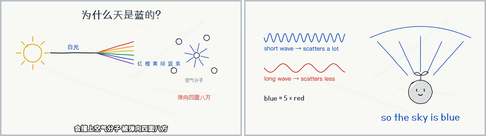
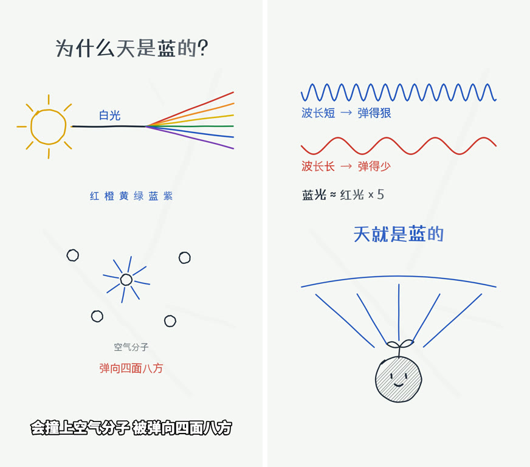
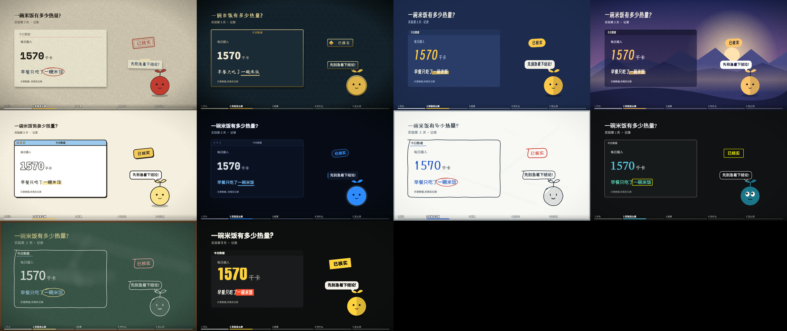
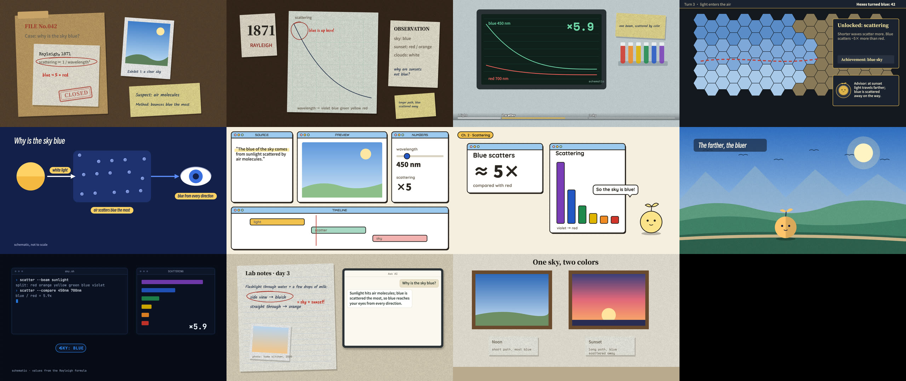

# explainer-video

**Make explainer videos with code — any topic, any of 10 visual styles, narrated, subtitled, rendered and checked by one engine.**
A [Claude Code](https://claude.com/claude-code) skill: the method (formats, scenes, styles, a design library) plus the engine that turns a script into a finished MP4.

中文说明:[README.zh.md](README.zh.md)



*"Why is the sky blue?" — the runnable example in [examples/sky-demo](examples/sky-demo/README.md), whiteboard style, free edge-tts voice; first 10 seconds.*

## Chinese and English · landscape and vertical
One page, one timeline: `?lang=en` switches to the English narration, subtitles and on-screen text; `vertFrame(t)` re-lays the same drawing for a 1080×1920 vertical cut (re-laid out, never cropped). Subtitles wrap automatically on narrow screens.





The whole example — both languages, both orientations — runs from [examples/sky-demo](examples/sky-demo/README.md) with no API key.

## Ten styles, one scene
The same scene and content with only the style layer swapped — switching style is one line (`VC.kit('whiteboard')`).



paper skeuomorphic · game UI · flat geometric · flat illustration · cartoon UI · dark tech · whiteboard · dark math · chalkboard · kinetic type — details in [styles/INDEX.en.md](styles/INDEX.en.md).

## Scene templates
Eleven ready-made visual worlds, each with its own writing sources, components and signature moves (shown here on one neutral topic, each in its default style):



case files · 1944 lab desk · data dashboard · strategy game · anatomy diagram · editing desk · info cards · side-scrolling landscape · tech terminal · paper lab notes + screen dialog · paintings and labels — details in [scenes/INDEX.en.md](scenes/INDEX.en.md). Narrative formats (true-experiment story, scenario guide, concept lesson, versus, list…) are in [formats/INDEX.en.md](formats/INDEX.en.md).

## How it works
A video is chosen by four questions — **what** (explainer, true story, tutorial, comparison…), **which field**, **what feel**, **which platforms** — and built from four independent layers:

| Layer | Decides | Library |
|---|---|---|
| Format | The narrative skeleton (12 formats: true-experiment story, story → method → test, scenario guide, concept lesson, versus, list…) | [formats/](formats/INDEX.en.md) |
| Scene | The visual world and its writing sources (case files, lab desk, strategy game, terminal, whiteboard…) | [scenes/](scenes/INDEX.en.md) |
| Style | How it's drawn (10 styles) | [styles/](styles/INDEX.en.md) |
| Channel profile | Your channel's own settings: voice, subtitles, platform rules, preferences | [profiles/](profiles/README.md) |

The page is plain HTML/SVG where `render(t)` draws the frame for time `t`; the engine renders it frame by frame with headless Chromium and hands everything else — narration, subtitles, mixing, thumbnails, vertical cut, acceptance — to one CLI.

## Quick start
In your project (Node ≥ 18, ffmpeg; whisper-cli recommended):
```bash
git clone https://github.com/WhiteRabbitLAB/baitu-video .claude/skills/explainer-video
npm init -y && npm i -D playwright && npx playwright install chromium
E=.claude/skills/explainer-video/engine/cli.mjs

# 1. project config + your channel profile (kept in YOUR project, not inside the skill)
cp .claude/skills/explainer-video/engine/explainer.example.json explainer.json
mkdir -p profiles && cp -r .claude/skills/explainer-video/profiles/_template profiles/my-channel
node $E doctor                        # checks everything; ❌ must be fixed

# 2. a new episode
node $E new lesson1 --style whiteboard   # script template + starter page
#    write brief/lesson1/script.zh.txt (blank line = new paragraph), then:
node $E narrate lesson1                  # voice + timeline (free edge-tts by default)
node $E subs lesson1                     # subtitles
node $E fonts lesson1                    # subset fonts for this page
node $E shot lesson1 3 8                 # look at two frames
node $E render lesson1 && node $E mix lesson1
node $E accept lesson1                   # 11 acceptance checks → out/lesson1/acceptance/summary.md
```
Or just ask Claude Code to "make an explainer video about …" — the skill tells it how. Full walkthrough: [engine/README.en.md](engine/README.en.md) · pipeline: [pipeline.en.md](pipeline.en.md).

## Narration providers
Pick one in `profiles/<channel>/voice.md`; providers without timestamps are aligned automatically with whisper.

| Provider | Status |
|---|---|
| Doubao (Volcengine), MiniMax, Alibaba Model Studio (Qwen TTS), OpenAI TTS, Gemini TTS, edge-tts (free) | tested 2026-10-08 |
| ElevenLabs, Azure Speech, Fish Audio | wired up from official docs, **untested** (no keys) — run `engine/tools/tts-probe.mjs` first, and PRs welcome |

## What's verified, honestly
- The engine reproduces a published 4.5-minute video **frame-for-frame and sample-for-sample** from its source (render, mix, subtitles, thumbnails).
- A fresh agent with no context made a working sample from an empty folder using only these docs; every snag it reported was fixed.
- Not yet verified: switching style mid-video, two characters in one shot, lip-sync, character acting in a finished video. Formats marked 🧪 have a skeleton but no sample yet.

## License
- Code and docs: [MIT](LICENSE).
- `profiles/example/` — the rabbit mascot and the decision-maker preferences — is the author's private material, **all rights reserved, no license granted**. It's there only to show what a filled-in profile looks like; make your own character.
- Bundled subset fonts: each under its own license (SIL OFL 1.1 / Apache 2.0), texts in [engine/vc/fonts/LICENSES/](engine/vc/fonts/LICENSES/README.md).
- Details: [NOTICE.md](NOTICE.md).
