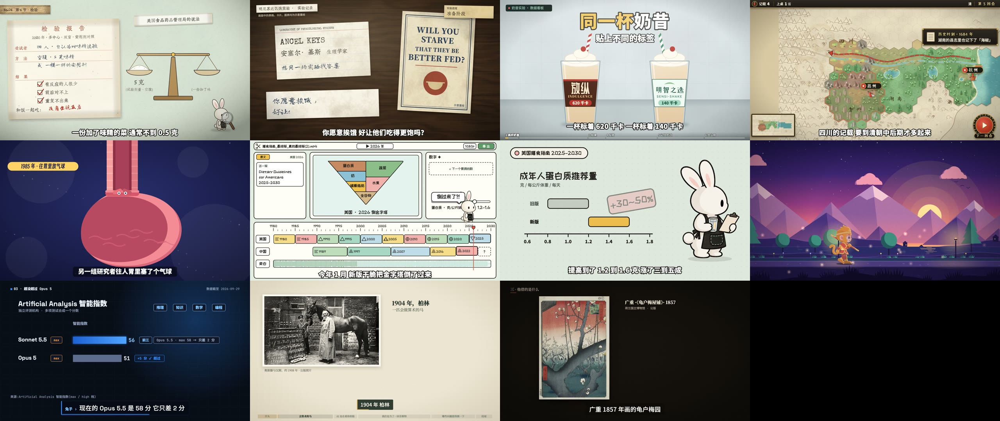

# explainer-video

**用代码做讲解视频:任何话题、10 种画风,配音、字幕、渲染、验收由一个引擎跑完。**
一个 [Claude Code](https://claude.com/claude-code) skill:方法(片型、场景、画风、设计库)加上把稿子变成成片 MP4 的引擎。

English: [README.md](README.md)


*「为什么天是蓝的」:能直接跑的示例期 [examples/sky-demo](examples/sky-demo/README.md),白板画风,免费的 edge-tts 配音;截的是前 10 秒。*

## 中文和英文 · 横版和竖版
同一个页面、同一条时间轴:加 `?lang=en` 就换成英文配音、英文字幕和英文画面字;`vertFrame(t)` 把同一套画法按 1080×1920 重新排一遍,做竖版(是重排,不是裁切)。字幕在窄屏上自动折行。


整个示例(两种语言、两种画幅)在 [examples/sky-demo](examples/sky-demo/README.md),不要任何密钥就能跑。

## 十种画风,同一个场景
同一个场景、同一段内容,只换画风层——换画风只改一行(`VC.kit('whiteboard')`)。


纸面拟物 · 游戏界面 · 扁平几何 · 扁平插画 · 卡通界面 · 科技深色 · 白板手绘 · 黑底数学 · 黑板粉笔 · 动态文字 —— 详见 [styles/INDEX.md](styles/INDEX.md)。

## 场景模板
11 个现成的画面世界,各有自己的书写来源、组件和签名动作。下图是作者用它们做的已发布成片截图:



档案案卷 · 1944 实验桌 · 数据看板 · 策略游戏 · 解剖图解 · 剪辑台 · 信息卡片 · 横版风景 · 科技终端 · 纸面记录 + 屏幕对话框 · 画作与展签 —— 详见 [scenes/INDEX.md](scenes/INDEX.md);同一个中性题目的简化示范帧在 [scenes/demo/](scenes/demo/_all.jpg)。叙事片型(真实实验纪实、场景攻略、概念教学、A vs B、清单……)见 [formats/INDEX.md](formats/INDEX.md)。

## 怎么运作
做一期先回答四个问题——**做什么**(科普、故事纪实、教程、对比评测……)、**什么行业**、**什么感觉**、**发哪些平台**——再由四个互相独立的层拼起来:

| 层 | 决定什么 | 库 |
|---|---|---|
| 片型 | 叙事骨架(12 种:真实实验纪实、故事引出方法 + 实测、场景攻略、概念教学、A vs B、清单……) | [formats/](formats/INDEX.md) |
| 场景 | 画面是个什么世界、里面谁在用什么写字(档案、实验桌、策略游戏、终端、白板……) | [scenes/](scenes/INDEX.md) |
| 画风 | 怎么画(10 种) | [styles/](styles/INDEX.md) |
| 频道配置 | 只属于你频道的设定:配音、字幕、平台规矩、偏好 | [profiles/](profiles/README.md) |

画面就是普通的 HTML/SVG 页面,`render(t)` 画出第 t 秒的那一帧;引擎用无头 Chromium 逐帧渲染,配音、字幕、混音、封面、竖版、验收都交给同一个命令行。

## 快速开始
在你的项目里(Node ≥ 18、ffmpeg;建议装 whisper-cli):
```bash
git clone https://github.com/WhiteRabbitLAB/baitu-video .claude/skills/explainer-video
npm init -y && npm i -D playwright && npx playwright install chromium
E=.claude/skills/explainer-video/engine/cli.mjs

# 1. 项目配置 + 你的频道配置(放在你自己的项目里,不放进 skill 目录)
cp .claude/skills/explainer-video/engine/explainer.example.json explainer.json
mkdir -p profiles && cp -r .claude/skills/explainer-video/profiles/_template profiles/my-channel
node $E doctor                        # 自检;❌ 必须先解决

# 2. 新建一期
node $E new lesson1 --style whiteboard   # 稿子模板 + 起步页面
#    写 brief/lesson1/script.zh.txt(空一行 = 新的一段),然后:
node $E narrate lesson1                  # 配音 + 时间轴(默认免费的 edge-tts)
node $E subs lesson1                     # 字幕
node $E fonts lesson1                    # 按页面切字体
node $E shot lesson1 3 8                 # 截两帧看看
node $E render lesson1 && node $E mix lesson1
node $E accept lesson1                   # 11 项验收 → out/lesson1/acceptance/summary.md
```
也可以直接跟 Claude Code 说「做一期讲 …… 的讲解视频」,skill 会告诉它怎么做。完整步骤:[engine/README.md](engine/README.md) · 流程:[pipeline.md](pipeline.md)。

## 配音服务
在 `profiles/<频道>/voice.md` 里选;接口不给时间戳的,引擎自动用 whisper 对齐。

| 服务 | 状态 |
|---|---|
| 豆包(火山引擎)、MiniMax、阿里百炼(通义 TTS)、OpenAI TTS、Gemini TTS、edge-tts(免费) | 2026-10-08 实测 |
| ElevenLabs、Azure 语音、Fish Audio | 按官方文档接入,**没有实测**(作者没有密钥)——用前先跑 `engine/tools/tts-probe.mjs`,欢迎提交实测结果 |

## 验证到哪一步(如实说)
- 引擎能把一部已发布的 4.5 分钟成片从源文件重新做出来,**画面逐帧相同、声音逐采样相同**(渲染、混音、字幕、封面)。
- 一个没有任何上下文的代理只靠这些文档,在空文件夹里做出了样片;它报的每个障碍都已修掉。
- 还没验证:片中换画风、两个角色同框、口型对配音、角色表演进正片。标 🧪 的片型有骨架、还没出过样片。

## 授权
- 代码与文档:[MIT](LICENSE)。
- `profiles/example/`(兔子吉祥物、决策者偏好)是作者私有素材,**保留所有权利,不授权任何使用**;放在这里只为示范频道配置怎么写,请做你自己的角色。
- 引擎自带的子集字体:各按自己的许可(SIL OFL 1.1 / Apache 2.0),原文在 [engine/vc/fonts/LICENSES/](engine/vc/fonts/LICENSES/README.md)。
- 详见 [NOTICE.md](NOTICE.md)。
