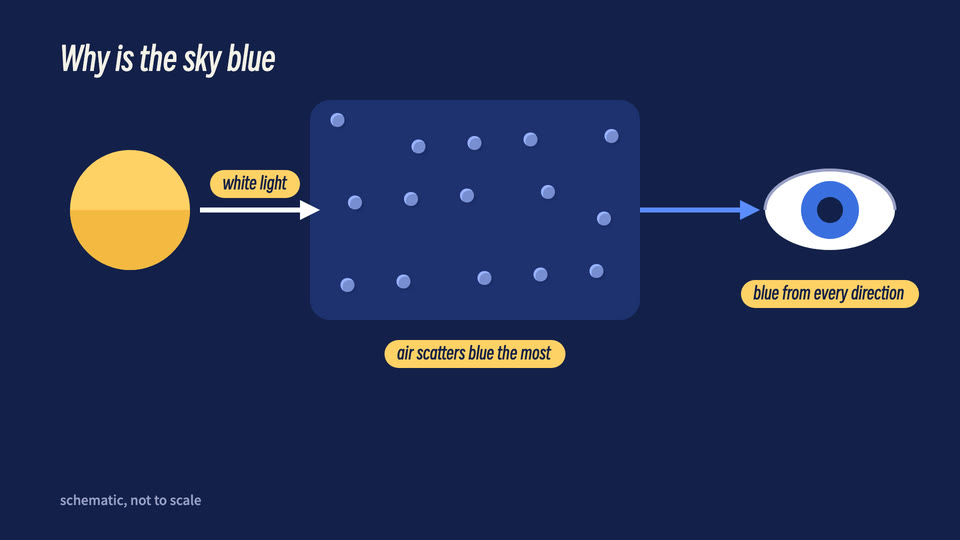

# Anatomy diagram (id: anatomy-diagram)

中文:[anatomy-diagram.md](anatomy-diagram.md)

*Demo frame (one neutral topic, "why is the sky blue?", default style; generated by `engine/vc/scene-gallery.html`)*

## Visual world
A clean set of flat science diagrams: dark blue background, no outlines, two-tone shading, yellow accents. The reference is option A, chosen by the decision-maker from three stills.

**Default style**: flat-geometric — see ../styles/. When switching style, this file's writing sources and components stay; their look is redrawn in the new style.

## Palette
Dark blue background; white text; highlight yellow #FFD166; capsules dark blue on yellow; credit gray #9AA0C8.

## Writing source → text roles (from past videos; this style deliberately uses only two fonts)
| Role | Chinese font | Latin / digits | Color | Carrier | Entrance |
|---|---|---|---|---|---|
| R1 Opening headline | Smiley Sans | Smiley Sans | white, key words yellow | Directly over the picture | Fade + rise |
| R2 Title | Smiley Sans | Smiley Sans | white | Chapter card | Fade + rise |
| R3 Body / labels | Smiley Sans | Smiley Sans | dark blue on yellow | Capsule labels | Fade + rise |
| R4 Big number | Smiley Sans | Smiley Sans | yellow | Directly over the picture | Fade + rise |
| R5 Primary source | Not used in this style (flat diagrams don't do scanned originals; if needed, Smiley Sans + a quote card) | | | | |
| R6 Annotation | Not used in this style (yellow highlight blocks instead of circling) | | | | |
| R7 Character dialogue | Smiley Sans | | white / ink | Speech bubble | Fade + rise |
| R8 Handwritten note | Not used in this style (there's no "written by a person" layer) | | | | |
| R9 Stamp / marker | Smiley Sans | | dark blue on yellow | Capsule | Fade in |
| R10 Source credit | Noto Sans SC 700 | | gray #9AA0C8 | Corner credit | Static |
| Subtitles (an exception for this style) | Noto Sans SC 900 48 px | | white | Translucent black rounded box | With narration |

## Components
Schematic anatomy, causal-chain arrows, capsule labels, chapter cards. Implemented in past videos (the third version became the full video).

## Mascot and characters
- The mascot can stay off screen (clean diagrams); if it appears, make it the same geometric shapes.
- Generated characters: the same constraints as the flat-illustration style (no outlines, shading one step darker in the same hue).

## Signature moves and transitions
Move the camera along the causal chain; elements fade in and rise.

## Cases
One mechanism explainer (finalized on its third version).

## Pitfalls
- The decision-maker rejected: a short-drama look, a hand-drawn high-detail texture look ("ugly assets, ugly fonts"); also rejected AI-generated assets (code drawing was wanted then).
- Show stills for the decision-maker to choose from before making the full video.
