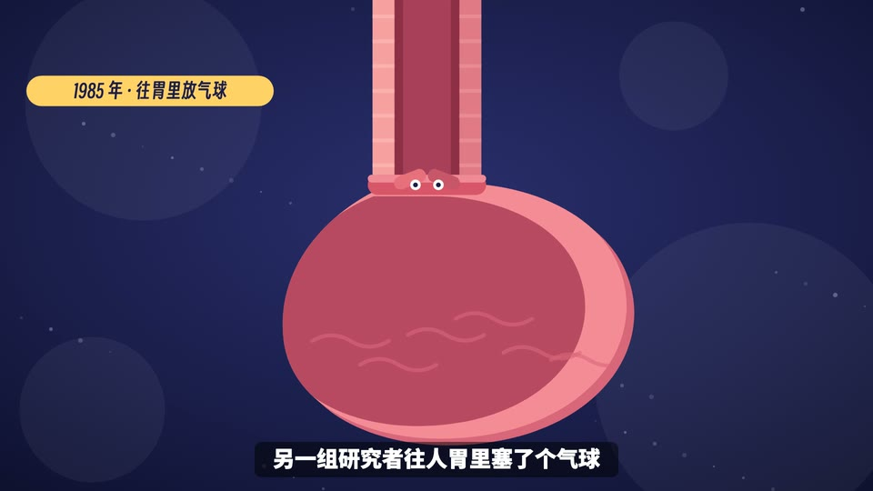

# 解剖图解(id: anatomy-diagram)

*成片截图(作者用这个场景做的已发布视频)。同一个中性题目的示范帧见 [demo/](demo/)。*

## 画面世界
一套干净的扁平科普图解:深蓝底、无描边、双色块明暗、黄色点缀。参考图是决策者从三张静帧里选的 A。

**默认画风**:flat-geometric —— 见 ../styles/。换画风时,本文件的书写来源与组件不变,造型按新画风重画。

## 色板
深蓝底;白字;重点黄 #FFD166;胶囊黄底深蓝字;出处灰 #9AA0C8。

## 书写来源 → 文字角色(出处 往期成片;本风格刻意只用两种字体)
| 角色 | 中文字体 | 英文/数字 | 颜色 | 承载物 | 出场方式 |
|---|---|---|---|---|---|
| R1 开头大字 | 得意黑 Smiley Sans | 得意黑 | 白,重点词黄 | 直接压画面 | 淡入 + 上滑 |
| R2 标题 | 得意黑 | 得意黑 | 白 | 章节卡 | 淡入 + 上滑 |
| R3 正文/标签 | 得意黑 | 得意黑 | 黄底深蓝字 | 胶囊标签 | 淡入 + 上滑 |
| R4 大数字 | 得意黑 | 得意黑 | 黄 | 直接压画面 | 淡入 + 上滑 |
| R5 一手原文 | 本风格不用(扁平图解不放原件扫描感;需要时用得意黑 + 引号卡) | | | | |
| R6 批注 | 本风格不用(用黄色高亮色块代替圈改) | | | | |
| R7 角色对白 | 得意黑 | | 白 / 墨 | 气泡 | 淡入 + 上滑 |
| R8 手记 | 本风格不用(没有「人写的字」这一层) | | | | |
| R9 印章/标记 | 得意黑 | | 黄底深蓝 | 胶囊 | 淡入 |
| R10 出处 | 思源黑体 700 | | 灰 #9AA0C8 | 角标 | 静态 |
| 字幕(本风格例外) | 思源黑体 900 48px | | 白字 | 半透明黑底圆角框 | 按配音 |

## 组件
示意解剖图、因果链箭头、胶囊标签、章节卡。实现:往期成片(第三版即整片)。

## 吉祥物与角色
- 吉祥物可以不出场(干净图解);要出场就做成同样的几何造型。
- 生图角色:与 flat-illustration 画风同一套约束(无描边、同色相深一档做暗面)。

## 签名动作与转场
沿因果链推镜头;元素淡入上滑。

## 案例
一部机制科普片(第三版定稿)。

## 踩坑
- 决策者否过:短剧风、手绘高精度材质风(「素材丑、字体丑」);否过 AI 生图素材(当时要的是代码画)。
- 先出静帧让决策者选,再做整片。
