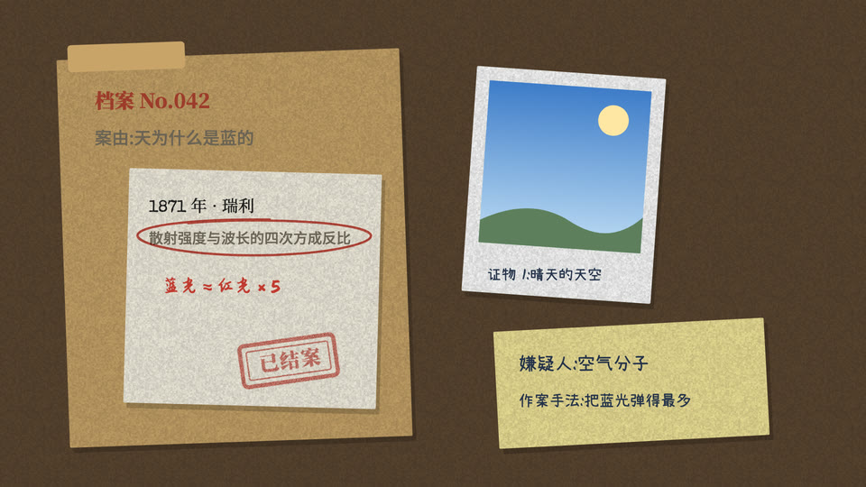

# 档案案卷(id: case-file)

*示范帧(同一个中性题目「天为什么是蓝的」,默认画风;由 `engine/vc/scene-gallery.html` 生成)*

## 画面世界
翻档案的感觉(决策者 2026-09-30 定):牛皮纸案卷、信件原文 + 荧光笔、红章、证物编号牌、嫌疑人照、拍立得、便签。俯拍桌面。

**默认画风**:paper-skeuo —— 见 ../styles/。换画风时,本文件的书写来源与组件不变,造型按新画风重画。

## 色板
频道底色(频道自己的色板,见频道配置)+ 档案纸面色板:
印刷黑 #2B2622、档案红 #9E3B2C(正片叠底)、钢笔蓝黑 #23324A、红笔 #B8322A。

## 书写来源 → 文字角色(出处 往期成片)
| 角色 | 中文字体 | 英文/数字 | 颜色 | 承载物 | 出场方式 |
|---|---|---|---|---|---|
| R1 开头大字 | 思源宋体 900 | — | 章红 / 档案红 | 开场红章(一个流行病名)、档案袋「档案」 | 落章 |
| R2 标题 | 朱雀仿宋(表格栏目);「档案」思源宋体 900 | — | 档案红 | 档案袋印刷栏 | 静态 |
| R3 正文/标签 | 朱雀仿宋(译文打字稿) | Special Elite | 印刷黑 | 打字稿、吊牌 | 逐字打出 |
| R4 大数字 | 不设专用字体,跟数字的书写来源走:打字稿朱雀仿宋(「每天 30 毫克」「5 克」)、红笔志莽行书(「≈ 1.8 克」)、钢笔龙藏体(「1968」「1908」) | Special Elite(证物编号牌) | 随来源 | 打字稿、批注、表格、编号牌 | 随来源(打出 / 写出) |
| R5 一手原文 | 思源宋体 | 思源宋体(1968 英文期刊) | 印刷黑 | 期刊原件 + 荧光笔 | 静态 |
| R6 批注 | 志莽行书 | — | 红笔 #B8322A 正片叠底 | 纸面空白处 | 一笔一笔写出 |
| R7 角色对白 | 站酷快乐体(频道配置) | — | 墨 | 气泡 | 弹出 |
| R8 手记 | 龙藏体(表格填写)/ 小赖(便签)/ 马善政(拍立得马克笔) | — | 蓝黑 / 墨 | 表格、便签、拍立得 | 逐字写出 |
| R9 印章/标记 | 思源宋体 900;字母板思源黑体 900 | Special Elite(吊牌) | 章红 / 米白 | 橡皮章、证物吊牌、塑料字母板 | 落章 / 静态 |
| R10 出处 | 打字标签里的中文没有指定字体,是字体栈回退出来的思源宋体 500(如「TRANSLATION · 译文节选」) | Special Elite | 印刷黑 / 灰 | 打字标签 | 静态 |

2026-10-07 按 往期成片 源码核实,本表已没有推断格。R10 的中文是回退出来的,不是刻意选的;下次用时如果想让打字标签整体像打字机,给中文明确指定朱雀仿宋。

## 组件
档案袋、证物编号牌、嫌疑人字母板、拍立得、便签、印章(油墨斑驳遮罩)。实现:往期成片。

## 吉祥物与角色
- 频道吉祥物当探员,拿放大镜。
- 生图角色:未试。建议提示词加「纸面剪贴质感、白色剪纸边、轻投影」,像贴在案卷上的照片。

## 签名动作与转场
翻开下一份文件、证物推到镜头前、落章收束。

## 案例
一部食品冤案片(整片 + 封面)。

## 踩坑
- 霞鹜文楷太工整像电脑字,手写改龙藏体。
- 手写错落幅度 ×1.4 才像人写的。
