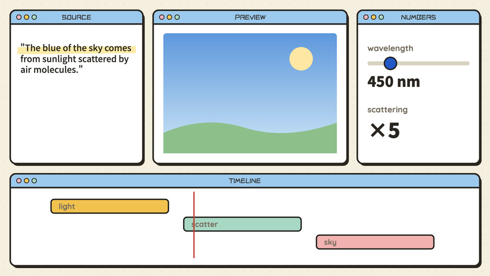

# Editing desk (id: editing-desk)

中文:[editing-desk.md](editing-desk.md)

*Demo frame (one neutral topic, "why is the sky blue?", default style; generated by `engine/vc/scene-gallery.html`)*

## Visual world
A cartoon video-editor UI (layout and animation style borrowed from a piece seen on Twitter): off-white paper, macaron hatched fills;
four areas, one job each: left = original text (highlighter), center = illustration (preview window), right = numbers (sliders), bottom = year timeline (one track per country + a narration track drawing the real voice waveform).

**Default style**: cartoon-ui — see ../styles/. When switching style, this file's writing sources and components stay; their look is redrawn in the new style.

## Palette
Macaron palette (../design/palettes.md).

## Writing source → text roles (that episode had no separate font table; verified against source and frames on 2026-10-07)
| Role | Chinese font | Latin / digits | Color | Carrier | Entrance |
|---|---|---|---|---|---|
| R1 Opening headline | ZCOOL KuaiLe | ZCOOL KuaiLe | ink | Preview window | Pop in |
| R2 Title | ZCOOL KuaiLe | ZCOOL KuaiLe | ink | Panel titles, clip names, file names | Static |
| R3 Body / labels | ZCOOL KuaiLe | ZCOOL KuaiLe | ink | Tracks, columns | Static |
| R4 Big number | ZCOOL KuaiLe ("300", "< 6") | ZCOOL KuaiLe | ink / accent | Right "numbers" panel, sliders | Slide (real values only, no flashing intermediates) |
| R5 Primary source | ZCOOL KuaiLe (English originals too) | ZCOOL KuaiLe | ink + highlighter | Left "original" panel | Typed letter by letter + highlighter sweep |
| R6 Annotation | ZCOOL KuaiLe | | red | Pop-ups ("too harsh"), red text on the timeline | Pop |
| R7 Character dialogue | ZCOOL KuaiLe (channel profile) | | ink | Speech bubble | Pop |
| R8 Handwritten note | Not used in this style (the UI has no handwriting layer) | | | | |
| R9 Stamp / marker | ZCOOL KuaiLe ("SNIP!" yellow with black outline) | ZCOOL KuaiLe | yellow / ink | Scissors gag, beat triangles, counters | Pop |
| R10 Source credit | ZCOOL KuaiLe | | translucent ink | Corner credit | Static |

(In the source, all on-screen text used one font constant `F` (ZCOOL KuaiLe, falling back to Noto Sans SC for missing glyphs); **Noto Sans SC 900 was used only for subtitles**. The earlier "Noto Sans SC 500/900" in this table was wrong and has been corrected.
This table records what that episode actually did, before the "choose fonts by writing source" rule existed: original text, numbers and UI text all shared one font. Next time, first choose source fonts for originals and numbers per ../text-roles.md — don't copy this table.)

## Components
Year timeline (one track per country / a rules track / a narration waveform track), clips, playhead, sliders, preview window, export button and progress bar. Implemented in past videos; the narration waveform is computed from the voice audio.

## Mascot and characters
- The channel mascot "operates the software" in the UI: dragging clips, wielding scissors, riding sliders.

## Signature moves and transitions
One editing-tool gag per paragraph (drag onto the track, beat markers, morph transition, scissors + rewind, slider mishap, buffering spinner + quick cut, diff), never the same one twice in a row; push in on the area being discussed, pull back to the full view afterwards; zoom punch.

## Cases
A rule-evolution video (two countries on one timeline).

## Pitfalls
- No SVG displacement-jitter filters (the fuzzy edges look blurry); key text ≥ about 28 px.
- A surprised character doesn't get enlarged black pupils (looks like a ghost); for adjusting a slider, "jump onto the knob and ride it" instead of stretching an arm.
