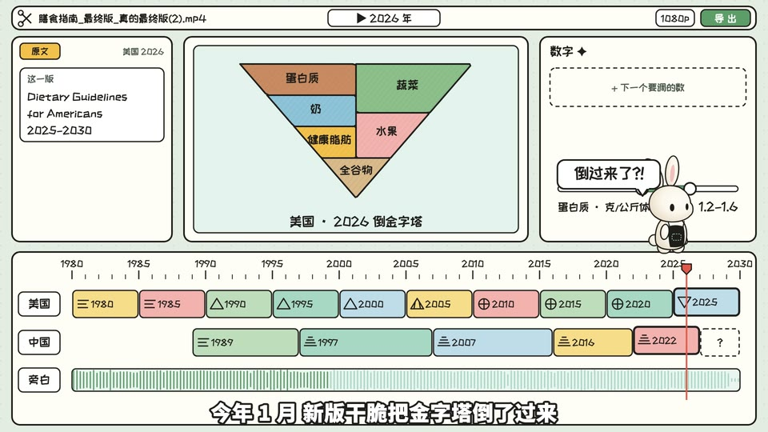

# 剪辑台(id: editing-desk)

*成片截图(作者用这个场景做的已发布视频)。同一个中性题目的示范帧见 [demo/](demo/)。*

## 画面世界
一个卡通剪辑软件界面(借一条推特作品的布局和动画风格):米白纸底、马卡龙排线填色;
四块各管一件事:左 = 原文(荧光笔)、中 = 图示(预览窗)、右 = 数字(滑杆)、下 = 年份时间轴(多国多轨 + 旁白轨,画真实配音波形)。

**默认画风**:cartoon-ui —— 见 ../styles/。换画风时,本文件的书写来源与组件不变,造型按新画风重画。

## 色板
马卡龙色板(../design/palettes.md)。

## 书写来源 → 文字角色(那期没有独立字体表;2026-10-07 按源码与成片截帧核实)
| 角色 | 中文字体 | 英文/数字 | 颜色 | 承载物 | 出场方式 |
|---|---|---|---|---|---|
| R1 开头大字 | 站酷快乐体 | 站酷快乐体 | 墨 | 预览窗 | 弹入 |
| R2 标题 | 站酷快乐体 | 站酷快乐体 | 墨 | 面板标题、片段名、文件名 | 静态 |
| R3 正文/标签 | 站酷快乐体 | 站酷快乐体 | 墨 | 轨道、栏目 | 静态 |
| R4 大数字 | 站酷快乐体(「300」「< 6」) | 站酷快乐体 | 墨 / 强调色 | 右栏「数字」面板、滑杆 | 滑动(只显示真实值,不闪中间值) |
| R5 一手原文 | 站酷快乐体(英文原文同) | 站酷快乐体 | 墨 + 荧光笔 | 左栏「原文」面板 | 逐字打出 + 荧光笔划过 |
| R6 批注 | 站酷快乐体 | | 红 | 弹窗(「太狠了」)、时间轴上的红字 | 弹出 |
| R7 角色对白 | 站酷快乐体(频道配置) | | 墨 | 气泡 | 弹出 |
| R8 手记 | 本风格不用(界面里没有手写层) | | | | |
| R9 印章/标记 | 站酷快乐体(「SNIP!」黄字黑描边) | 站酷快乐体 | 黄 / 墨 | 剪刀梗、节拍三角、计数器 | 弹出 |
| R10 出处 | 站酷快乐体 | | 墨半透明 | 角标 | 静态 |

(源码里画面上的字全部走同一个字体常量 `F`(站酷快乐体,缺字回退思源黑体);**思源黑体 900 只用在字幕上**。以前表里写的「思源黑体 500/900」都不对,已更正。
这张表是那期当时的实际做法,那时还没有「按书写来源选字体」的规矩:原文、数字和界面字都用同一种字体。下次再用这个场景,先按 ../text-roles.md 给原文、数字重新选来源字体,不要照抄这张表。)

## 组件
年份时间轴(两国各一轨 / 规则轨 / 旁白波形轨)、片段、播放头、滑杆、预览窗、导出按钮与进度条。实现:往期成片;旁白波形由配音音频算出。

## 吉祥物与角色
- 频道吉祥物在界面上「操作软件」:搬片段、举剪刀、踩滑杆。

## 签名动作与转场
每段一种剪辑工具梗(拖拽入轨、节拍标记、变形转场、剪刀 + 倒带、滑杆翻车、缓冲圈 + 快切、diff 对比),同一种不连用;镜头推近讲的那一块,讲完拉回全景;zoom punch。

## 案例
一部规则演进片(两国同轴对照)。

## 踩坑
- 不用 SVG 位移抖动滤镜(毛边显糊);关键字 ≥ 约 28px。
- 角色吃惊不放大黑眼珠(像鬼);改滑杆用「跳上滑块踩着滑」代替伸长胳膊。
