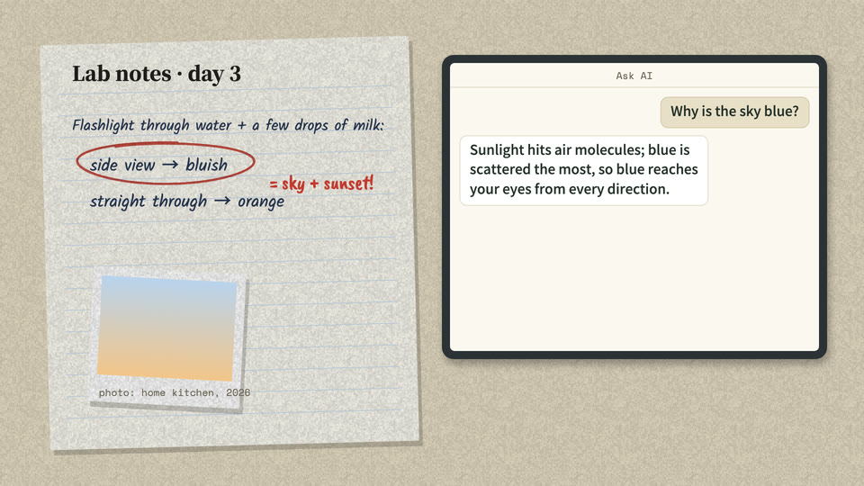

# Paper lab notes + screen dialog (id: field-notebook)

中文:[field-notebook.md](field-notebook.md)

*Demo frame (one neutral topic, "why is the sky blue?", default style; generated by `engine/vc/scene-gallery.html`)*

## Visual world
Lab notes on off-white paper: big printed type, old archive photos with captions, our ballpoint notebook, red-pencil corrections; **AI answers live in an on-screen dialog box**, kept apart from the paper — paper is "what people wrote down", the screen is "what the machine said".

**Default style**: [paper-skeuo](../styles/paper-skeuo.en.md) (paper) + a screen dialog box.

## Palette
Channel colors (the author's AI channel palette — replace with yours): forest green #1C2A22, off-white #EEE5D3, warm gold #D9A84E; gray #6B6A5E; blue-black #23324A; red pencil #B23A2E.

## Writing source → text roles (from past videos)
| Role | Writing source | Chinese font | Latin / digits | Color | Carrier | Entrance |
|---|---|---|---|---|---|---|
| R1 Opening headline | Narration titles, conclusion lines (magazine-style big print) | Noto Serif SC 900 | Cormorant Garamond | forest green | Paper | Rise + fade |
| R2 Title | Same | Noto Serif SC 900 | Cormorant Garamond | forest green | Paper | Rise + fade |
| R3 Body / labels | Archive notes, photo captions, tables (printed) | Noto Serif SC 500 | Cormorant Garamond | forest green / gray | Paper, captions | Static |
| R4 Big number | Test numbers, counts | — | JetBrains Mono | forest green / warm gold | Record table | Counting up |
| R5 Primary source | A century-old English archive, years (old book type) | Noto Serif SC | Cormorant Garamond roman / italic | forest green | Archive page | Static |
| R6 Annotation | Red-pencil notes, circling, scoring | Zhi Mang Xing | (English version: Caveat Brush) | red #B23A2E | Paper | Written out / circled |
| R7 Character dialogue | The AI's answers, the user's questions | Noto Sans SC 500 | | dark gray text on white bubbles | Phone / computer screen dialog | Typed letter by letter |
| R8 Handwritten note | Our lab notebook (ballpoint); a poem in the author's hand (hard pen) | Xiaolai; Long Cang | (English version: Caveat / Kalam) | blue-black | Notebook | Written character by character |
| R9 Marker | Stamps | Noto Serif SC 900 | | warm gold / red | Stamp | Stamped down |
| R10 Source credit | Photo captions (with the real year, no website names) | Noto Serif SC 500 | | gray | Caption | Static |

## Through-line elements
The lab notebook (plan, raw results and stats all written in it); the screen dialog box.

## Mascot and characters
The mascot can be a lab assistant beside the notebook; no human head silhouettes (after the decision-maker's feedback all 5 were removed and replaced with diagrams / dots / historical photos / pure typography).

## Signature moves and transitions
The dialog box is there from the very start, typing letter by letter; red pencil circles numbers; photos slide in.

## Cases
A psychology-story + real-test video (zh and en: `?lang=en` is the English version, with its own English scenes anchored to English sentence times).

## Pitfalls
- The opening can't be empty: the dialog box appears immediately (the decision-maker caught 13–20 s of emptiness).
- Public-domain photo captions carry each photo's real year, not one blanket year.
- When the English version has no burned-in subtitles, transitions must overlap to avoid gaps.
