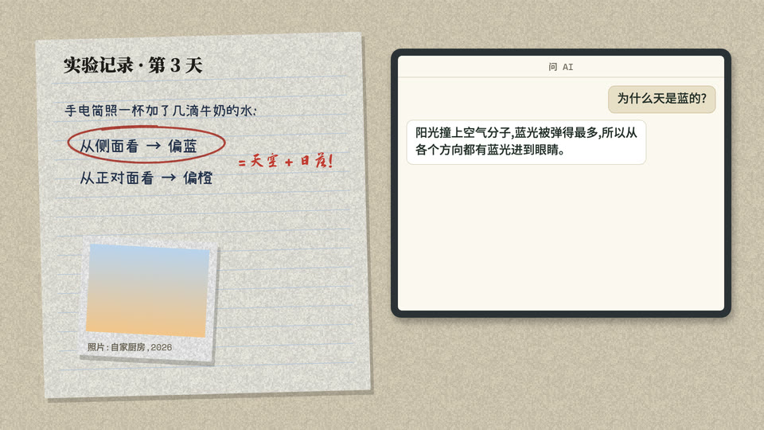

# 纸面实验记录 + 屏幕对话框(id: field-notebook)

*示范帧(同一个中性题目「天为什么是蓝的」,默认画风;由 `engine/vc/scene-gallery.html` 生成)*

## 画面世界
米白纸面的实验记录:印刷大字、旧档案照片与题注、我们的圆珠笔记录本、红铅笔圈改;**AI 的回答放在屏幕对话框里**,与纸面区分开——纸是「人记下的」,屏幕是「机器说的」。

**默认画风**:[paper-skeuo](../styles/paper-skeuo.md)(纸面)+ 屏幕对话框。

## 色板
频道色(作者 AI 频道的色板,换成你的):墨绿 #1C2A22、米白 #EEE5D3、暖金 #D9A84E;灰 #6B6A5E;蓝黑 #23324A;红铅笔 #B23A2E。

## 书写来源 → 文字角色(出处 往期成片)
| 角色 | 书写来源 | 中文字体 | 英文/数字 | 颜色 | 承载物 | 出场方式 |
|---|---|---|---|---|---|---|
| R1 开头大字 | 旁白的标题、结论句(杂志式印刷大字) | 思源宋体 900 | Cormorant Garamond | 墨绿 | 纸面 | 上浮淡入 |
| R2 标题 | 同上 | 思源宋体 900 | Cormorant Garamond | 墨绿 | 纸面 | 上浮淡入 |
| R3 正文/标签 | 档案说明、照片题注、表格(印刷) | 思源宋体 500 | Cormorant Garamond | 墨绿 / 灰 | 纸面、题注 | 静态 |
| R4 大数字 | 实测数字、次数 | — | JetBrains Mono | 墨绿 / 暖金 | 记录表 | 计数滚动 |
| R5 一手原文 | 百年前的英文档案、年份(旧书铅字) | 思源宋体 | Cormorant Garamond 正 / 斜 | 墨绿 | 档案页 | 静态 |
| R6 批注 | 红铅笔批注、圈改、打分 | 志莽行书 | (英文版 Caveat Brush) | 红 #B23A2E | 纸面 | 逐字写出 / 圈画 |
| R7 角色对白 | AI 的回答、用户的提问 | 思源黑体 500 | | 深灰字 + 白底气泡 | 手机 / 电脑屏幕对话框 | 逐字打出 |
| R8 手记 | 我们的实验记录本(圆珠笔);作者手写的诗(硬笔) | 小赖;龙藏体 | (英文版 Caveat / Kalam) | 蓝黑 | 记录本 | 逐字写出 |
| R9 标记物 | 印章 | 思源宋体 900 | | 暖金 / 红 | 章 | 落章 |
| R10 出处 | 照片题注(写真实年份,不写网站名) | 思源宋体 500 | | 灰 | 题注 | 静态 |

## 贯穿元素
实验记录本(方案、原始结果、统计都写在上面);屏幕对话框。

## 吉祥物与角色
吉祥物可在记录本旁边做实验助手;不画人头侧影(决策者反馈后 5 处全部拿掉,改成图解 / 圆点 / 历史照片 / 纯排版)。

## 签名动作与转场
对话框开场即出现、逐字打出;红铅笔圈数字;照片滑入。

## 案例
一部心理学故事 + 实测片(中英两版:`?lang=en` 为英文版,英文场景单独一套、锚英文句时间)。

## 踩坑
- 开头不能空:对话框开场即出现(决策者抓到 13–20 秒空)。
- 公版照片题注写各自真实年份,不笼统归到一个年份。
- 英文版不烧字幕时,转场要交叠,避免空档。
