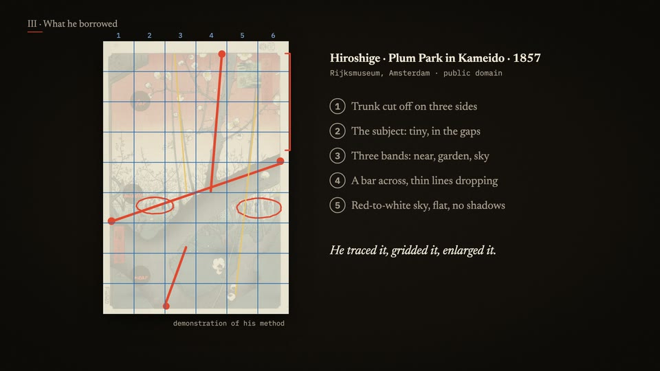

# Paintings and labels (id: gallery-wall)

中文:[gallery-wall.md](gallery-wall.md)

*Screenshot from a published video the author made with this scene. Demo frames on one neutral topic are in [demo/](demo/).*

## Visual world
Like looking at paintings in a museum: public-domain masterpieces full-frame or hung on a wall, with wall-label style text beside them; when breaking down composition, guide lines are laid over the painting;
the generated images of a comparison experiment hang on the wall in groups (the same prompt × 8 images).

**Default style**: [paper-skeuo](../styles/paper-skeuo.en.md) (labels and paper) + real paintings.

## Palette
Off-white walls / black-text labels, few colors; the channel's warm gold for emphasis.

## Writing source → text roles
That episode's page was deleted (only the finished video remains); **this table was compiled from the script and the thumbnail plan, so all of it is inferred**. Next time, the new samples take precedence.

| Role | Writing source | Suggested font | Carrier | Entrance |
|---|---|---|---|---|
| R1 Opening headline | Exhibition title | Noto Serif SC 900 / a Latin serif | Big type on the wall | Fade in |
| R2 Title | Gallery sections | Noto Serif SC 900 | Wall | Fade in |
| R3 Body / labels | Wall labels (artist, year, medium) | Noto Serif SC 500 / Cormorant Garamond | Off-white label | Static |
| R4 Big number | Years | Serif numerals | Label | Static |
| R5 Primary source | The painter's letters | Noto Serif SC; Latin italic | Letter card | Static |
| R6 Annotation | Composition guide lines and notes | Handwriting or thin lines | Over the painting | Drawn |
| R7 Character dialogue | Mascot | The channel bubble font | Speech bubble | Pop |
| R8 Handwritten note | The "five questions" checklist | Handwriting | Sticky note | Written character by character |
| R9 Marker | Experiment group labels (A / B / C) | Sans serif | Number tag | Static |
| R10 Source credit | Public-domain image source and year | Noto Serif SC 500 | Small label text | Static |

## Through-line elements
The exhibition wall; the same "five questions" walked through once in the story and once in our own case.

## Signature moves and transitions
Push in on details of a painting; guide lines drawn one by one; comparison images hung up one at a time.

## Cases
An art-history story + generation-comparison video (zh and en).

## Pitfalls
- Thumbnails use the real painting with label-style layout, not AI-generated images ("too AI" feedback).
- Generation comparisons save prompts verbatim (`prompts.txt`), changing one thing under the same conditions.
