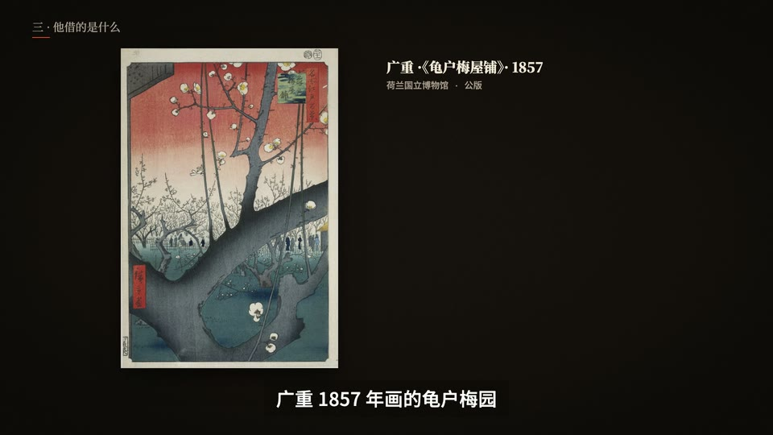

# 画作与展签(id: gallery-wall)

*成片截图(作者用这个场景做的已发布视频)。同一个中性题目的示范帧见 [demo/](demo/)。*

## 画面世界
像在美术馆看画:公版名作满版或挂在墙上,旁边是展签式的说明;拆构图时在画上叠辅助线;
对比实验的生成图按组并排上墙(同一条提示词 × 8 张)。

**默认画风**:[paper-skeuo](../styles/paper-skeuo.md)(展签与纸面)+ 真实画作。

## 色板
米白墙面 / 黑字展签,少色;强调用频道暖金。

## 书写来源 → 文字角色
那期的画面页已删除(只留成片),**本表按稿子与封面方案整理,整表算推断**;再用时以新的样张为准。

| 角色 | 书写来源 | 建议字体 | 承载物 | 出场方式 |
|---|---|---|---|---|
| R1 开头大字 | 展览标题 | 思源宋体 900 / 衬线英文 | 墙面大字 | 淡入 |
| R2 标题 | 展厅分区 | 思源宋体 900 | 墙面 | 淡入 |
| R3 正文/标签 | 展签(作者、年份、材质) | 思源宋体 500 / Cormorant Garamond | 米白展签 | 静态 |
| R4 大数字 | 年份 | 衬线数字 | 展签 | 静态 |
| R5 一手原文 | 画家书信 | 思源宋体;英文斜体 | 书信卡 | 静态 |
| R6 批注 | 拆构图的辅助线与标注 | 手写或细线 | 叠在画上 | 画出 |
| R7 角色对白 | 吉祥物 | 频道气泡字体 | 气泡 | 弹出 |
| R8 手记 | 「五个问题」清单 | 手写 | 便签 | 逐字写出 |
| R9 标记物 | 实验组标签(A / B / C) | 无衬线 | 编号牌 | 静态 |
| R10 出处 | 公版图来源与年份 | 思源宋体 500 | 展签小字 | 静态 |

## 贯穿元素
展墙;同一套「五个问题」在故事段和我们的案例段各走一遍。

## 签名动作与转场
推近画作局部;辅助线逐条画出;对比墙一张张挂上。

## 案例
一部艺术史故事 + 生成对比片(中英两版)。

## 踩坑
- 封面用真画、展签式排版,不用 AI 生成图(「太 AI」反馈)。
- 生成图对比要逐字保存提示词(`prompts.txt`),同条件只改一处。
