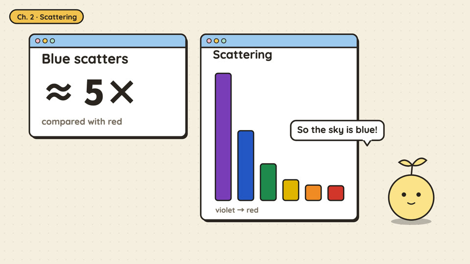

# Info cards (id: info-cards)

中文:[info-cards.md](info-cards.md)

*Demo frame (one neutral topic, "why is the sky blue?", default style; generated by `engine/vc/scene-gallery.html`)*

## Visual world
The most basic explainer scene: rounded info cards on a plain background (numbers, comparisons, food illustrations), a host character standing to one side doing a small action at each paragraph start (hop / head tilt / raising a whiteboard), and a small chapter tag top left that changes with each paragraph.

**Default style**: cartoon-ui — see ../styles/. When switching style, writing sources and components stay; their look is redrawn in the new style.

## Palette
Macaron palette (../design/palettes.md); 6 px outlines.

## Writing source → text roles
This scene has no "text written by people in the world" — everything is the show's own graphic text, so only two fonts are used.

| Role | Chinese font | Color | Carrier | Entrance |
|---|---|---|---|---|
| R1 Opening headline | ZCOOL KuaiLe ("How much a day?" 72 px) | ink | Card | Pop |
| R2 Title | ZCOOL KuaiLe | ink | Small chapter tag top left | Changes per paragraph |
| R3 Body / labels | ZCOOL KuaiLe (card labels, legends); **the small gray units and notes** in Noto Sans SC 500 (units like "g / day" and "except …" notes) | ink; small text #4E5A53 | Card | Pop |
| R4 Big number | Noto Sans SC 900 (computed numbers, axis ticks: "60", "2000", "about x%"); exception: the numbers in two capsules used ZCOOL KuaiLe | ink / accent | Card | Pop / number change |
| R5 Primary source | Not used (no original-document layer) | | | |
| R6 Annotation | Not used | | | |
| R7 Character dialogue | ZCOOL KuaiLe | ink | Whiteboard / bubble | Raised |
| R8 Handwritten note | ZCOOL KuaiLe | ink | Whiteboard | Raised |
| R9 Stamp / marker | Not used | | | |
| R10 Source credit | Neither video had an on-screen credit | | | |

(Verified against past source on 2026-10-07: the pages had only three font classes — `sv` ZCOOL KuaiLe, `nb` Noto Sans SC 900, `nm` Noto Sans SC 500 — and the table follows what each spot actually used. The two R4 exceptions were inconsistencies at the time; next time use Noto Sans SC 900 for all numbers. If you add R10, reuse R3's small gray text spec.)

## Through-line elements
The host character stays on one side; the small chapter tag.

## Mascot and characters
The host is the channel mascot (see your channel profile).

## Signature moves and transitions
Cards pop in and out; one small action per paragraph from the character; the end card raises the whiteboard.

## Cases
Two early nutrition videos.

## Pitfalls
The plainest scene, with a weak sense of world; the author's later episodes all switched to scenes with a world (case files, games, labs) and got a better audience response. Good for shorts or as a bridge inside a long video.
