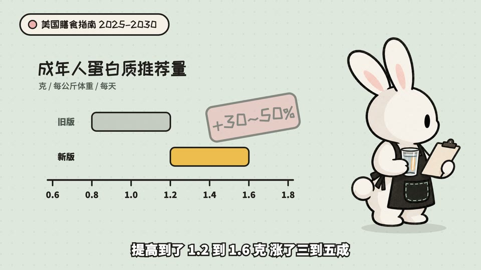

# 信息卡片(id: info-cards)

*成片截图(作者用这个场景做的已发布视频)。同一个中性题目的示范帧见 [demo/](demo/)。*

## 画面世界
最基础的讲解场景:纯色底上一张张圆角信息卡(数字、对比、食物图示),一个主持角色站在一侧,每段开头做一个小动作(跳 / 歪头 / 举写字板),左上角章节小标签随段切换。

**默认画风**:cartoon-ui —— 见 ../styles/。换画风时,书写来源与组件不变,造型按新画风重画。

## 色板
马卡龙色板(../design/palettes.md);6px 描边。

## 书写来源 → 文字角色
这个场景没有「世界里的人写的字」,所有字都是节目自己的图形字,所以只用两种字体。

| 角色 | 中文字体 | 颜色 | 承载物 | 出场方式 |
|---|---|---|---|---|
| R1 开头大字 | 站酷快乐体(「每天该吃多少」72px) | 墨 | 卡片 | 弹出 |
| R2 标题 | 站酷快乐体 | 墨 | 左上章节小标签 | 随段切换 |
| R3 正文/标签 | 站酷快乐体(卡片标签、图例);**灰色的单位和注释小字**用思源黑体 500(「克 / 每天」「某某除外」这类单位和例外说明) | 墨;小字 #4E5A53 | 卡片 | 弹出 |
| R4 大数字 | 思源黑体 900(算出来的数、坐标刻度:「60」「2000」「约 x%」);例外:有两个胶囊里的数字用的是站酷快乐体 | 墨 / 强调色 | 卡片 | 弹出 / 数字变化 |
| R5 一手原文 | 不用(没有原件这一层) | | | |
| R6 批注 | 不用 | | | |
| R7 角色对白 | 站酷快乐体 | 墨 | 写字板 / 气泡 | 举起 |
| R8 手记 | 站酷快乐体 | 墨 | 写字板 | 举起 |
| R9 印章/标记 | 不用 | | | |
| R10 出处 | 两期画面上都没有出处角标 | | | |

(2026-10-07 按往期源码核实:页面只有三个字体类,`sv` 站酷快乐体、`nb` 思源黑体 900、`nm` 思源黑体 500,上表已按每处实际用的类写。R4 的两个例外是当时没统一,下次用时数字统一用思源黑体 900。R10 下次要加的话,沿用 R3 灰色小字的规格。)

## 贯穿元素
主持角色常驻一侧;章节小标签。

## 吉祥物与角色
主持角色就是频道吉祥物(见频道配置)。

## 签名动作与转场
卡片弹入弹出;角色每段一个小动作;结束卡举写字板。

## 案例
两部早期营养科普片。

## 踩坑
这是最朴素的场景,世界观弱;作者的频道之后各期都换成了有世界观的场景(档案、游戏、实验室),观众反馈更好。适合短片或作为长片里的过渡段。
