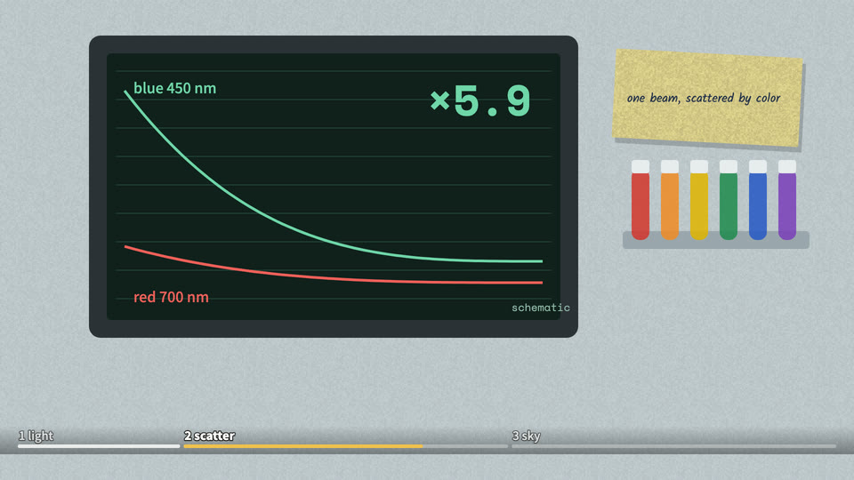

# Lab data dashboard (id: lab-dashboard)

中文:[lab-dashboard.md](lab-dashboard.md)

*Demo frame (one neutral topic, "why is the sky blue?", default style; generated by `engine/vc/scene-gallery.html`)*

## Visual world
A modern clinical research ward: a pale grey-blue lab bench with experiment objects appearing one by one; **one ever-present dark monitor is the star of the whole video** (curves drawn in real time, compared, overturned).
13 walls, panning at each paragraph start.

**Default style**: paper-skeuo (paper objects) + an instrument-screen UI — see ../styles/. When switching style, this file's writing sources and components stay; their look is redrawn in the new style.

## Palette
Bench pale grey-blue; screen #10201C, curves red #F0605A / green #6FD6A8, scale grey-green; opening headline white with black stroke, keyword yellow #F2C14E; red pen #C23A30; notebook blue #24324C.

## Writing source → text roles (from past videos)
| Role | Chinese font | Latin / digits | Color | Carrier | Entrance |
|---|---|---|---|---|---|
| R1 Opening headline | Noto Sans SC 900 | — | white with black stroke, keyword yellow | Directly over the picture | Pop in |
| R2 Title | Noto Sans SC 900 | Space Mono 700 | grey-green on screen / black on flyers | Screen labels, flyers | Static / pinned |
| R3 Body / labels | Noto Sans SC 500 | Space Mono 400 | scale grey-green | Monitor UI | Digits ticking |
| R4 Big number | Noto Sans SC 900 | Space Mono 700 | red / green on screen | Monitor, counters | Ticking (real values only) |
| R5 Primary source | Noto Serif SC 900/500 | Abril Fatface (journal name) | black | Journal page, name tags | Slide in whole |
| R6 Annotation | Zhi Mang Xing | — | red #C23A30 | Corrections | Drawn stroke by stroke |
| R7 Character dialogue | The channel's bubble font (see channel profile) | — | per channel profile | Speech bubble | Pop |
| R8 Handwritten note | Xiaolai | Xiaolai | blue #24324C | Researcher's notebook | Written character by character |
| R9 Stamp / marker | Noto Sans SC 500 | Space Mono | black on white | A test strip "measured: ××× kcal" | Typed line by line |
| R10 Source credit | Noto Sans SC 500 | Space Mono | grey-green | An on-screen "schematic" label | Always on |
| Product packaging (that episode only) | Qingke Huangyou / ZCOOL XiaoWei | Abril Fatface / Quicksand | cream on chocolate / dark green on mint | Two product labels | Slide in whole |

## Components
Monitor (curves drawn over time), blood-tube rack (caps light up in turn), timeline bar, 2×2 table, sticky notes on the screen edge; the **chapter progress bar** was first built here; a Douyin vertical cut (`?render&vert`, the landscape frame shrunk into vertical) was also first made here — **that cropped kind of vertical was judged a failure by the decision-maker on 2026-10-07 and is retired**: vertical must be re-laid out for vertical, see ../pipeline.md §9. Implemented in past videos.

## Mascot and characters
- The channel mascot = research assistant (apron). No likenesses of real people (name tags, numbered wristbands, empty seats).

## Signature moves and transitions
The monitor lowers / goes full screen / shrinks back; pan to the next wall at each paragraph start.

## Cases
A documentary-style video about a "same thing, two labels" experiment.

## Pitfalls
Curves with direction but no values ⇒ schematic shape + a permanent "schematic" label.
