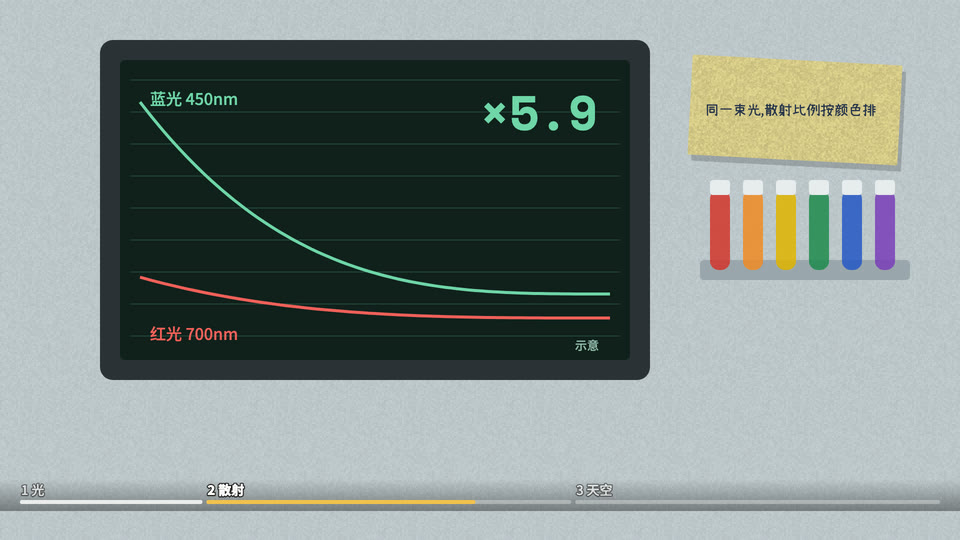

# 实验室数据看板(id: lab-dashboard)

*成片截图(作者用这个场景做的已发布视频)。同一个中性题目的示范帧见 [demo/](demo/)。*

## 画面世界
现代临床研究病房:浅灰蓝实验台面,台上依次出现实验物件;**一台常驻的深色监护屏是全片主角**(曲线实时画出、对照、被推翻)。
13 面墙,段首横移。

**默认画风**:paper-skeuo(纸质物件)+ 仪器屏界面 —— 见 ../styles/。换画风时,本文件的书写来源与组件不变,造型按新画风重画。

## 色板
台面浅灰蓝;屏底 #10201C,曲线红 #F0605A / 绿 #6FD6A8,刻度灰绿;开头大字白字黑描边、关键词黄 #F2C14E;红笔 #C23A30;记录本蓝 #24324C。

## 书写来源 → 文字角色(出处 往期成片)
| 角色 | 中文字体 | 英文/数字 | 颜色 | 承载物 | 出场方式 |
|---|---|---|---|---|---|
| R1 开头大字 | 思源黑体 900 | — | 白字黑描边,关键词黄 | 直接压画面 | 弹入 |
| R2 标题 | 思源黑体 900 | Space Mono 700 | 屏上灰绿 / 传单黑 | 屏幕标签、传单 | 静态 / 钉上 |
| R3 正文/标签 | 思源黑体 500 | Space Mono 400 | 刻度灰绿 | 监护屏界面 | 数字跳动 |
| R4 大数字 | 思源黑体 900 | Space Mono 700 | 屏上红/绿 | 监护屏、计数器 | 跳动(只显示真实值) |
| R5 一手原文 | 思源宋体 900/500 | Abril Fatface(刊名) | 黑 | 期刊页、名牌 | 整张滑入 |
| R6 批注 | 志莽行书 | — | 红 #C23A30 | 圈改 | 逐笔画出 |
| R7 角色对白 | 频道气泡字体(见频道配置) | — | 频道配置 | 气泡 | 弹出 |
| R8 手记 | 小赖 | 小赖 | 蓝 #24324C | 研究员记录本 | 逐字写出 |
| R9 印章/标记 | 思源黑体 500 | Space Mono | 白底黑字 | 检验条「实测 ××× 千卡」 | 一行行打出 |
| R10 出处 | 思源黑体 500 | Space Mono | 灰绿 | 屏上「示意」角标 | 常驻 |
| 商品包装(本期特有) | 庆科黄油体 / 站酷小薇 | Abril Fatface / Quicksand | 巧克力底奶油字 / 薄荷底墨绿字 | 两张商品标签 | 整张滑入 |

## 组件
监护屏(曲线按时间画出)、采血管架(管帽依次亮)、时间轴横条、2×2 表格、便签贴屏边;**章节进度条**首个实现在这里;抖音竖版(`?render&vert`,把横版整帧缩小放进竖屏)最早在这里做过,**这种裁切式竖版 2026-10-07 被决策者判不合格、已作废**:竖版要按竖屏重新排版,见 ../pipeline.md §9。实现:往期成片。

## 吉祥物与角色
- 频道吉祥物 = 研究助理(围裙)。不画真人肖像(名牌、编号腕带、空座位)。

## 签名动作与转场
监护屏降下 / 全屏 / 缩回;段首横移到下一面墙。

## 案例
一部「同样东西、两种标签」的实验纪实片。
一部续集:同一间研究室,监护屏改跑神经元活动曲线(光纤读数),台面上换成小鼠笼;上一部的道具和标签原样回来,用画面交代「这是续集」。

## 踩坑
曲线只有走向没有数值 ⇒ 示意形状 + 常驻「示意」角标。
- 推进转场(zoom-through)缩小镜头时,画面外露出来的是画风底色(纸面米色),一圈米色很扎眼 ⇒ 自己画的房间只在这个转场里、只给**新镜头**(从开口里由小放大的那个)铺到画面外;**横移 / 推移转场别铺大**:两镜并排,新镜头铺大的房间会把旧镜头整个盖住(2026-10-09 实测,整片重渲染了一次)。
- 实验动物按吉祥物同一套画法画(墨线描边 + 体积渐变 + 圆润整形),否则和吉祥物同框像两套素材(决策者 2026-10-09:「老鼠的素材有点不好看」,重画后「好很多」)。
- 「看见食物」这类先降后稳的读数,按论文的时间常数压缩成几秒的示意;读数数字只出真实值(如 96%),不做从 0 往上数的动画。
