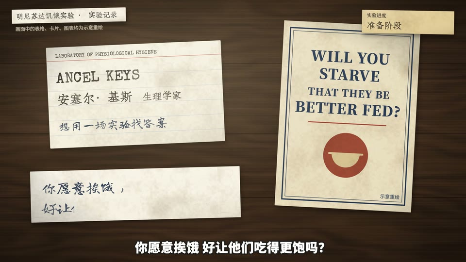

# 1944 lab desk (id: lab-desk-1944)

中文:[lab-desk-1944.md](lab-desk-1944.md)

*Screenshot from a published video the author made with this scene. Demo frames on one neutral topic are in [demo/](demo/).*

## Visual world
The desk of a mid-20th-century university physiology lab (top-down): a dark wooden desk, printed forms, typewritten record cards, a researcher's fountain-pen notes, red-pencil corrections,
period Isotype pictograms, and one weight-chart sheet of graph paper that runs through the whole video. Cool white desk-lamp light + paper texture + film grain.

**Default style**: paper-skeuo — see ../styles/. When switching style, this file's writing sources and components stay; their look is redrawn in the new style.

## Palette
Dark wooden desk, paper white; print black #2A2622, fountain-pen blue-black #24324C, red pencil #B8322A (multiply), modern sticky-note ballpoint blue #1E2A44; Isotype ink / ochre.

## Writing source → text roles (from past videos)
| Role | Chinese font | Latin / digits | Color | Carrier | Entrance |
|---|---|---|---|---|---|
| R1 Opening headline | Noto Serif SC 900 | Special Elite (NOVEMBER) | print black; the month in red #8E2A22 | A tear-off calendar ("1944 / November") | The calendar slides onto the desk, then pages tear off; the text is printed, not written out |
| R2 Title | Noto Serif SC 500/900 | Special Elite | print black | Form headers, column names, calendar month | Static |
| R3 Body / labels | Zhuque Fangsong (Chinese typewriter) | Special Elite | ribbon black, uneven letter by letter | Record cards, ration cards, memos | Typed letter by letter |
| R4 Big number | Zhuque Fangsong / Special Elite | Special Elite | ribbon black; circled in red pencil | Ration card | Typed, then circled in red |
| R5 Primary source | Noto Serif SC (translated booklet) | Special Elite (original English title) | print black | A public-education booklet of the time | Static |
| R6 Annotation | Zhi Mang Xing | — | red pencil, multiply | Circled numbers, question marks, underlines | Written stroke by stroke |
| R7 Character dialogue | ZCOOL KuaiLe (channel profile) | — | ink | Speech bubble | Pop |
| R8 Handwritten note | Long Cang (fountain-pen notes); Xiaolai (a modern sticky note, the only modern object in the video) | — | blue-black / ballpoint blue | Paper, sticky notes | Written character by character |
| R9 Stamp / marker | Special Elite | Special Elite | print black | Numbered record cards, experiment progress tag | Static / flip |
| R10 Source credit | Special Elite | | print black | Typed label | Static |
| Chart labels | Noto Sans SC 900 | | ink / ochre | Isotype charts | Static |

Verified against past source code and video frames on 2026-10-07; no inferred cells remain.

## Components
6×6 numbered record cards, ration card, tear-off calendar, Isotype pictograms, weight-chart graph paper, an experiment progress tag top right, a typed label top left. Implemented in past videos (13 desks).
Sound effects are registered by the typing / handwriting / stamping components themselves.

## Mascot and characters
- The channel mascot = lab assistant (apron), holding a clipboard.
- No likenesses of real people: number cards, name tags.

## Signature moves and transitions
At each paragraph start the camera pans to the next desk; typewriter letter by letter; red-pencil corrections.

## Cases
- **Ward variant**: the same writing sources, without the tear-off calendar and Isotype; instead a medical chart (signature move: flipping pages), diet record cards, test reports, meat on a plate; built with the shared engine/vc components (the first finished video made with them).
- Original: a documentary-style video about a human starvation experiment.

## Pitfalls
Take only the weights you use of Noto Serif SC and Special Elite, never the whole set (the engine's `fonts <ep>` now cuts only what's used, automatically).
