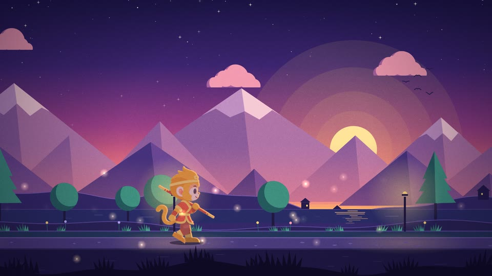

# Side-scrolling landscape (id: landscape-scroll)

中文:[landscape-scroll.md](landscape-scroll.md)

*Screenshot from a published video the author made with this scene. Demo frames on one neutral topic are in [demo/](demo/).*

## Visual world
Kurzgesagt-style flat illustration: a valley at dusk, a horizontal scroll. Multi-layer parallax (sky → two rows of distant mountains + a mist band at their foot → hills with a village → lake → trees on the shore → a path → foreground grass),
and the picture is always moving (twinkling stars, drifting clouds, flocks of birds, glints on the lake, swaying trees, window lights, street lamps, fireflies). The character stands on the path; the background scrolls by "distance walked".

**Default style**: flat-illustration — see ../styles/. When switching style, this file's writing sources and components stay; their look is redrawn in the new style.

## Palette (PAL in scene.html)
Sky #1B1446 → #3D2470 → #9A3F86 → #E2687A → #FFAD62; sun #FFE39A;
far mountains light/dark #B073A8 / #8C5B9C, near #6A4594 / #47317C; trees light/dark #3F8F80 / #25585E; ground #1C1640, path #4A3A7C; foreground #0E0A24.

## Materials and post
No outlines, shading one step darker in the same hue; snow caps jagged on both sides; paper grain (overlay 9%, offset changing 12 times a second); vignette.

## Writing source → text roles (the test had no text; these are suggestions, unverified)
| Role | Chinese font | Latin / digits | Color | Carrier | Entrance |
|---|---|---|---|---|---|
| R1 Opening headline | Smiley Sans (same family as flat-geometric) | Smiley Sans | cream, key words #FFAD62 | Over the sky | Fade + rise |
| R2 Title | Smiley Sans | | cream | Rounded translucent dark-purple plate | Fade + rise |
| R3 Body / labels | Noto Sans SC 500 | | cream | Capsule labels | Fade in |
| R4 Big number | Smiley Sans | | #FFE39A | Over the picture | Rolling digits |
| R5 Primary source | Noto Serif SC 500 | | ink | An off-white card (the only non-flat object) | Slide in |
| R6 Annotation | Not used in this style (warm highlight blocks) | | | | |
| R7 Character dialogue | ZCOOL KuaiLe (channel profile) | | ink | White rounded bubble, no outline | Pop |
| R8 Handwritten note | Not used in this style | | | | |
| R9 Stamp / marker | Smiley Sans | | dark purple on warm yellow | Capsule | Pop |
| R10 Source credit | Noto Sans SC 500 | | cream 50% | Corner credit | Static |

## Components
Parallax layers, deterministic randomness (hashed by world coordinates, so scrolling doesn't flicker), a distance function `X(t)` (decelerating to a stop), character slot at x=720 / feet y=948 / height 300.

## Mascot and characters (this style is the test bed for the character-acting module; see ../characters/act-pipeline.md)
- Four rules for image prompts: pure green background #00B140, flat fills without outlines, light from behind right (a warm rim light on the right #FFAD62), no ground or shadow; the palette goes in the prompt.
- Relighting in code: multiply #C4B0E4 into the dusk purple → a right-side rim light (the outline minus itself offset (-4,2) down-left, 90%) → source-atop warm light near street lamps → an elliptical shadow under the feet → the same grain and vignette as the scene.

## Signature moves and transitions
The camera moves right at a steady speed + parallax; shooting stars; street lamps light up passers-by.

## Cases
A 9.5-second walking scene with a generated character (a test, not in a finished video).

## Pitfalls
- A street lamp must not stand where the character stops (they get washed out, with the pole behind them).
- Ground speed must be derived from the character's stride (a code-skeleton leg rig matches automatically).
