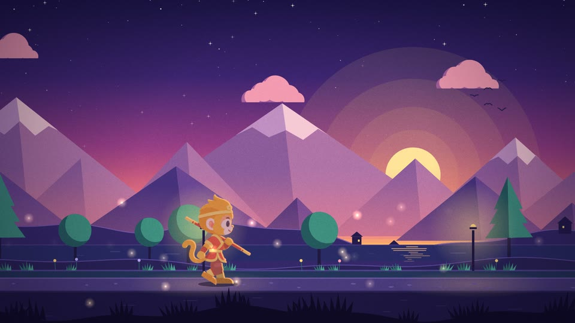

# 横版风景(id: landscape-scroll)

*成片截图(作者用这个场景做的已发布视频)。同一个中性题目的示范帧见 [demo/](demo/)。*

## 画面世界
Kurzgesagt 一路的扁平插画:黄昏山谷,横版卷轴。多层视差(天空 → 远山两排 + 山脚雾带 → 山丘村庄 → 湖 → 岸边树 → 地面小路 → 前景草),
画里一直在动(星闪、云飘、鸟群、湖面碎光、树摆、窗灯、路灯、萤火虫)。人物站在小路上,背景按「走过的距离」卷动。

**默认画风**:flat-illustration —— 见 ../styles/。换画风时,本文件的书写来源与组件不变,造型按新画风重画。

## 色板(scene.html 的 PAL)
天空 #1B1446 → #3D2470 → #9A3F86 → #E2687A → #FFAD62;太阳 #FFE39A;
远山亮/暗 #B073A8 / #8C5B9C,近山 #6A4594 / #47317C;树亮/暗 #3F8F80 / #25585E;地面 #1C1640、小路 #4A3A7C;前景 #0E0A24。

## 材质与后期
无描边、同色相深一档做暗面;雪顶锯齿两面;纸面颗粒(overlay 9%,每秒换 12 次偏移);暗角。

## 书写来源 → 文字角色(试验场未出现文字,以下为建议,未验证)
| 角色 | 中文字体 | 英文/数字 | 颜色 | 承载物 | 出场方式 |
|---|---|---|---|---|---|
| R1 开头大字 | 得意黑(与 flat-geometric 同族) | 得意黑 | 奶白,关键词 #FFAD62 | 压天空 | 淡入上滑 |
| R2 标题 | 得意黑 | | 奶白 | 圆角半透明深紫牌 | 淡入上滑 |
| R3 正文/标签 | 思源黑体 500 | | 奶白 | 胶囊标签 | 淡入 |
| R4 大数字 | 得意黑 | | #FFE39A | 压画面 | 数字滚动 |
| R5 一手原文 | 思源宋体 500 | | 墨 | 米白卡片(唯一非扁平物件) | 滑入 |
| R6 批注 | 本风格不用(用暖色高亮块) | | | | |
| R7 角色对白 | 站酷快乐体(频道配置) | | 墨 | 白色圆角气泡,无描边 | 弹出 |
| R8 手记 | 本风格不用 | | | | |
| R9 印章/标记 | 得意黑 | | 深紫字暖黄底 | 胶囊 | 弹出 |
| R10 出处 | 思源黑体 500 | | 奶白 50% | 角标 | 静态 |

## 组件
视差层、确定性随机(按世界坐标哈希,卷动不闪)、`X(t)` 距离函数(减速停下)、人物槽位 x=720 / 脚底 y=948 / 身高 300。

## 吉祥物与角色(本风格是角色表演模块的试验场,见 ../characters/act-pipeline.md)
- 生图提示词四规矩:纯绿底 #00B140、无描边平涂、光从右后方来(右侧暖色轮廓光 #FFAD62)、不画地面与投影;色板写进提示词。
- 代码补光:multiply #C4B0E4 压进黄昏紫调 → 右侧轮廓光(轮廓减去向左下错开 (-4,2) 的自己,90%)→ 靠近路灯时 source-atop 暖光 → 脚下椭圆投影 → 与场景同一道颗粒与暗角。

## 签名动作与转场
镜头匀速右移 + 视差;流星划过;路灯照亮经过的人。

## 案例
一段 9.5 秒的生图角色走路小戏(试验,未进正片)。

## 踩坑
- 路灯不能落在人物停步处(会被照白、灯杆在身后)。
- 地面速度要由角色步幅反推(代码骨骼腿则自动匹配)。
