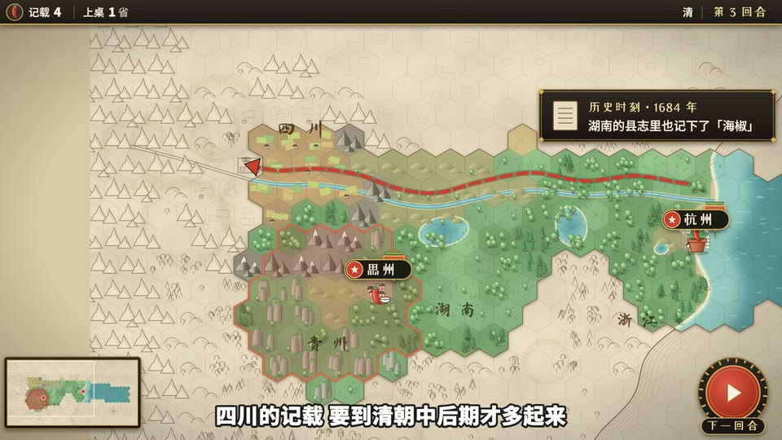

# Civilization-style strategy game (id: strategy-game)

中文:[strategy-game.md](strategy-game.md)

*Screenshot from a published video the author made with this scene. Demo frames on one neutral topic are in [demo/](demo/).*

## Visual world
The whole video = a screen recording of a hex-grid strategy game (decision-maker: if you're going for the Civilization feel, **don't make it rough** — map, UI and materials need game-level polish).
Two map layers: unexplored = a parchment antique map (brown-ink line work, brush-written place names); explored = colored terrain. Wherever the thing travels, the fog lifts hex by hex.

**Default style**: game-ui — see ../styles/. When switching style, this file's writing sources and components stay; their look is redrawn in the new style.

## Palette
Game-panel palette (../design/palettes.md): dark panels with gold edges; **the player color goes to the protagonist's faction only** (e.g. red, magenta #A23E5E). Ivory / gold text.

## Writing source → text roles (from past videos)
| Role | Chinese font | Latin / digits | Color | Carrier | Entrance |
|---|---|---|---|---|---|
| R1 Opening headline | ZCOOL XiaoWei | — | ivory / gold | Turn banner | Banner unfurls |
| R2 Title | ZCOOL XiaoWei | — | ivory / gold | Panel titles, buttons, city name plates | Panel slides in |
| R3 Body / labels | Noto Sans SC 500/900 | Noto Sans SC | ivory | Top bar, unit panel | Static |
| R4 Big number | Noto Sans SC 900 | | ivory; flashes gold + a gold ripple when the value changes | Top-bar counters (recorded N / reached N regions), stats panel | Jumps to the new value (real values only) |
| R5 Primary source | Noto Serif SC 900 (vertical Ming-style woodblock) | — | ink, red-ink marks | "Moment in history" card | Card flips in |
| R6 Annotation | Red dashed strategy arrows (9 px, dash 26/18, multiply); the question mark at the arrow tip in Ma Shan Zheng 70 px | — | red | On the map | Drawn along the route |
| R7 Character dialogue | ZCOOL KuaiLe (channel profile) | — | ink | Advisor dialog (gold-framed portrait) | Pop |
| R8 Handwritten note | Ma Shan Zheng (brush place names on the antique map) | — | brown ink | Parchment map | Revealed as the fog lifts |
| R9 Stamp / marker | ZCOOL XiaoWei | — | gold | Achievement bar, unit flags | Pop |
| R10 Source credit | Noto Sans SC 500 | | translucent ivory | Credit "Source: …" 24 px; the title line in the "moment in history" card ("Author, *Title*") in the same font, opaque | Fade in |

Verified against past source code on 2026-10-07; no inferred cells remain.

## Components
Hex map (two layers + fog), top bar, minimap, "Next turn" button, unit panel, city name plates, unit flags, "moment in history" card, achievement bar, resource bar (locked slots "?").
Implemented in past videos (the second reused the first one's engine with a different player color).

## Mascot and characters
- The channel mascot is the "advisor", in a gold-framed portrait.
- Generated characters: not tried. In-game unit portraits suit image generation; they must share the UI's light source.

## Signature moves and transitions
Each paragraph **unlocks one new game mechanic**, no repeats; turn banners; fog reveals; map pans.

## Cases
Two videos on how foreign crops spread.

## Pitfalls
- ZCOOL XiaoWei's "回" has three contours in the same direction ⇒ a solid block; fixed with `engine/tools/fix-winding.py`. Its "宋" looks like "市" — place names containing it switch to Noto Serif SC 900.
- Take only the Noto Serif SC 900 shards; pulling in another episode's whole fonts.css registers unused fonts and the render gate blocks falsely.
- Maps label provinces only; no administrative or national borders.
