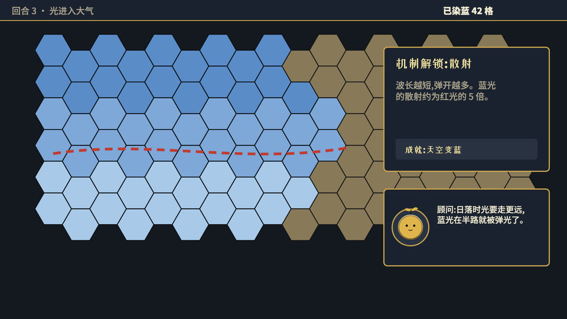

# 文明式策略游戏(id: strategy-game)

*示范帧(同一个中性题目「天为什么是蓝的」,默认画风;由 `engine/vc/scene-gallery.html` 生成)*

## 画面世界
整片 = 一局六边形格子策略游戏的录屏(决策者:既然用文明的感觉就**别做得太粗糙**,地图、界面、材质要有游戏级精致度)。
地图两层:未探索 = 羊皮纸古地图(褐墨线描、毛笔地名);已探索 = 彩色地形。东西走到哪,迷雾一格一格翻开。

**默认画风**:game-ui —— 见 ../styles/。换画风时,本文件的书写来源与组件不变,造型按新画风重画。

## 色板
游戏面板色板(../design/palettes.md):深色面板金边;**玩家色只给主角阵营**(例:正红、紫红 #A23E5E)。象牙白 / 金字。

## 书写来源 → 文字角色(出处 往期成片)
| 角色 | 中文字体 | 英文/数字 | 颜色 | 承载物 | 出场方式 |
|---|---|---|---|---|---|
| R1 开头大字 | 站酷小薇 | — | 象牙白 / 金 | 回合横幅 | 横幅展开 |
| R2 标题 | 站酷小薇 | — | 象牙白 / 金 | 面板标题、按钮、城市名牌 | 面板滑入 |
| R3 正文/标签 | 思源黑体 500/900 | 思源黑体 | 象牙白 | 顶栏、单位面板 | 静态 |
| R4 大数字 | 思源黑体 900 | | 象牙白;数值变化时闪金 + 金色扩散圈 | 顶栏计数器(记载 N / 已到达 N 个地区)、统计面板 | 跳到新值(只显示真实值) |
| R5 一手原文 | 思源宋体 900(竖排明刻本) | — | 墨,朱笔圈点 | 历史时刻卡 | 卡片翻入 |
| R6 批注 | 红色虚线战略箭头(9px,虚线 26/18,正片叠底);箭头尖上的问号用马善政 70px | — | 红 | 地图上 | 沿路线画出 |
| R7 角色对白 | 站酷快乐体(频道配置) | — | 墨 | 顾问对话框(金框头像) | 弹出 |
| R8 手记 | 马善政(古地图毛笔地名) | — | 褐墨 | 羊皮纸地图 | 迷雾翻开时显出 |
| R9 印章/标记 | 站酷小薇 | — | 金 | 成就条、单位旗 | 弹出 |
| R10 出处 | 思源黑体 500 | | 象牙白半透明 | 角标「来源:…」24px;历史时刻卡里的书名行((「作者《书名》」))同字体、不透明 | 淡入 |

2026-10-07 按 往期成片 源码核实,本表已没有推断格。

## 组件
六边形地图(两层 + 迷雾)、顶栏、小地图、「下一回合」按钮、单位面板、城市名牌、单位旗、历史时刻卡、成就条、资源栏(锁格「?」)。
实现:往期成片(第二部换玩家色复用第一部的引擎)。

## 吉祥物与角色
- 频道吉祥物当「顾问」,在金框头像里。
- 生图角色:未试。游戏里的单位立绘适合生图;要求与 UI 同光源。

## 签名动作与转场
每段**解锁一种游戏机制**,不重复;回合横幅;迷雾翻开;地图平移。

## 案例
两部外来作物传播史。

## 踩坑
- 站酷小薇「回」三条轮廓同向 ⇒ 实心方块,`engine/tools/fix-winding.py` 修;「宋」字形像「市」,含「宋」的地名改用思源宋体 900。
- 只摘思源宋体 900 分片,整套引用别期的 fonts.css 会注册用不到的字体,渲染门禁误拦。
- 地图只标省名,不画行政边界与国界。
