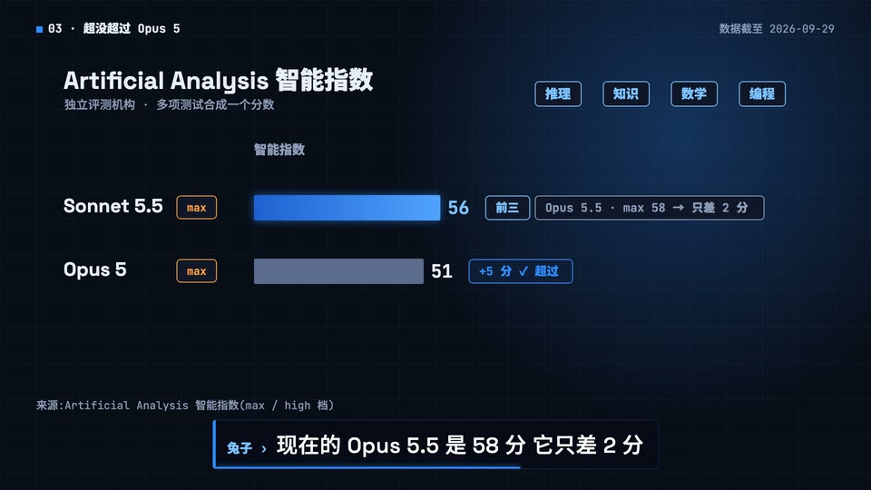

# 科技终端(id: terminal-tech)

*成片截图(作者用这个场景做的已发布视频)。同一个中性题目的示范帧见 [demo/](demo/)。*

## 画面世界
深色科技界面:深蓝黑底上的终端窗口、卡片、数据面板,线条和数字带一点蓝色辉光;演示用「我们自己风格的终端动画」,不模仿任何真实产品界面。

**默认画风**:[tech-ui](../styles/tech-ui.md)。换画风时,书写来源与组件不变,造型按新画风重画。

## 色板
科技深色(../design/palettes.md):底 #070B16、面板 #0E1528、线 #1C2A47、蓝 #2E8BFF、辉光 #7CC2FF、弱字 #8C9BB8;浅色页面 #EEF0F4 / 墨 #1B1D22。

## 书写来源 → 文字角色(2026-10-07 按往期源码与成片截帧核实)
页面只加载了 Space Grotesk 500/700、JetBrains Mono 400/700、思源黑体 500/900。两种英文字体都没有中文,中文按字重回退到思源黑体:要 700 的落到 900,要 400 的落到 500。下表写的是**实际渲染出来的**字重。

| 角色 | 书写来源 | 中文字体 | 英文/数字 | 颜色 | 承载物 | 出场方式 |
|---|---|---|---|---|---|---|
| R1 开头大字 | 节目标题 | 思源黑体 900 | Space Grotesk 700 | 白 | 直接压画面(128 / 96px 两行) | 逐字打出 + 闪烁光标,上方先打一行蓝色等宽小标签 |
| R2 标题 | 页面 / 卡片标题 | 思源黑体 900 | Space Grotesk 700 | 白;序号蓝 | 页面左上(「发布速览」54–72px)、卡片头 | 上浮淡入 |
| R3 正文/标签 | 界面文字 | 思源黑体 500 | Space Grotesk 500 | 白;强调暖橙 #FF9E3D | 卡片、列表、图表轴标签 | 上浮淡入 |
| R3 小标签 | 面板角标签 | 思源黑体 900 | JetBrains Mono 700 | 弱字 #8C9BB8 | 面板左上(「RELEASE」「智能指数」) | 随面板 |
| R4 大数字 | 仪表 / 跑分 / 价格 | 思源黑体 900(数字里夹的中文) | JetBrains Mono 700 | 白 / 辉光蓝 #7CC2FF / 暖橙(代价) | 数据面板、条形末端 | 随条形增长计数滚动 |
| R5 一手原文 | 官方原话 / 文档 | 两期都没有单独的引文卡,下次用时再定 | | | | |
| R6 批注 | 强调 | — | — | 暖橙 / 蓝描边框 | 框住结论(「代价:…」) | 上浮淡入 |
| R7 角色对白 | 吉祥物 | 底部字幕条就是吉祥物在说话:正文思源黑体 500 | 「吉祥物名 ›」JetBrains Mono 700;正文 Space Grotesk 500 47px | 名字辉光蓝,正文白 | 字幕条(不另画气泡) | 按配音 |
| R8 手记 | 本场景不用(界面里没有手写层) | | | | | |
| R9 标记物 | 状态标签 | 思源黑体 900 | JetBrains Mono 700 | 蓝 / 暖橙描边 + 同色字,深色底(不是蓝底白字) | 胶囊 | 随所在页面淡入 |
| R10 出处 | 来源角标 | 思源黑体 500 | JetBrains Mono 400 | 弱字 | 左下「来源:…」24px;右上「数据截至 …」 | 随页面 |
| 终端 | 命令与输出 | 思源黑体 900 | JetBrains Mono 700 | 蓝 / 白 / 弱字(色板里没有绿色) | 开场标签、窗口标题 | 逐字打出 + 闪烁光标 |

(往期两部的「窗口」大多是重绘的应用界面(「AI 旅行攻略」「航班查询」)或装图表的窗,没有真正的命令行输出;第一次真做终端输出时,把这一行补实。)

## 贯穿元素
同一个终端 / 工作台窗口;出处角标。

## 吉祥物与角色
吉祥物在界面旁边当操作员、举牌。

## 签名动作与转场
终端逐字打出命令、输出滚动;卡片翻转;数字计数。

## 案例
两部 AI 用法片(新模型解读、旅行攻略);风格样张决策者评「符合科技风」。

## 踩坑
- 不要画成真实产品的界面(版权 / 误导);演示标「示意动画」。
- 画面上不出现网址(实测:画面上出现一个产品域名,被平台限流)。
- 抽帧自查常抓到「空画面」「数字没数完」「标签重叠」「窗框贴字」,两轮截图自查是标配。
