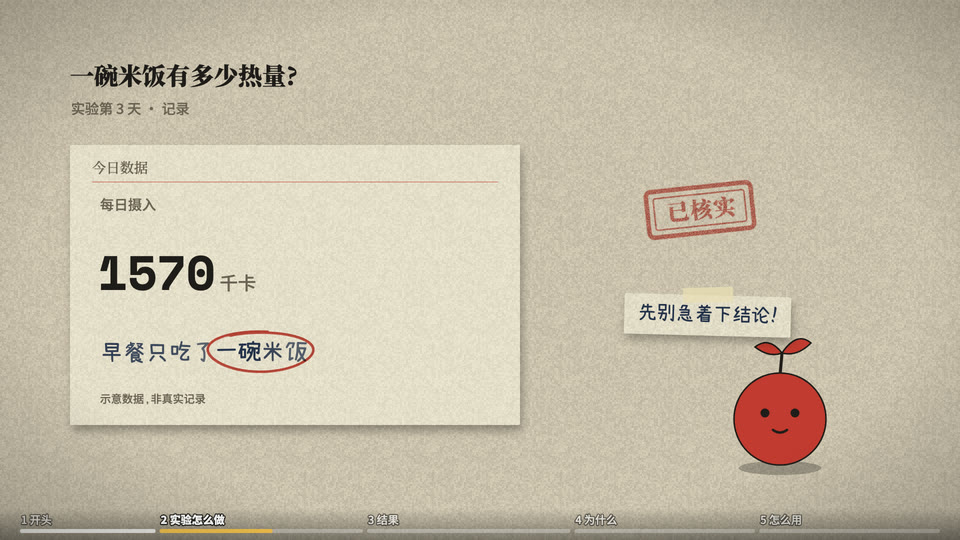
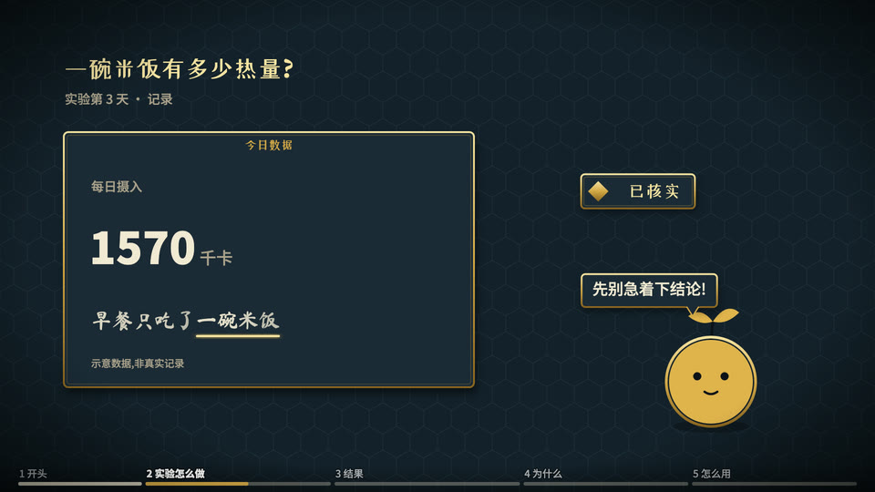
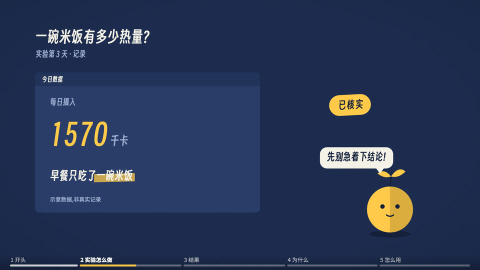
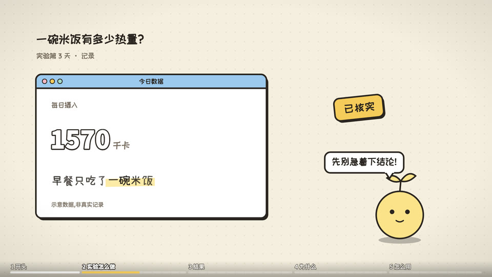
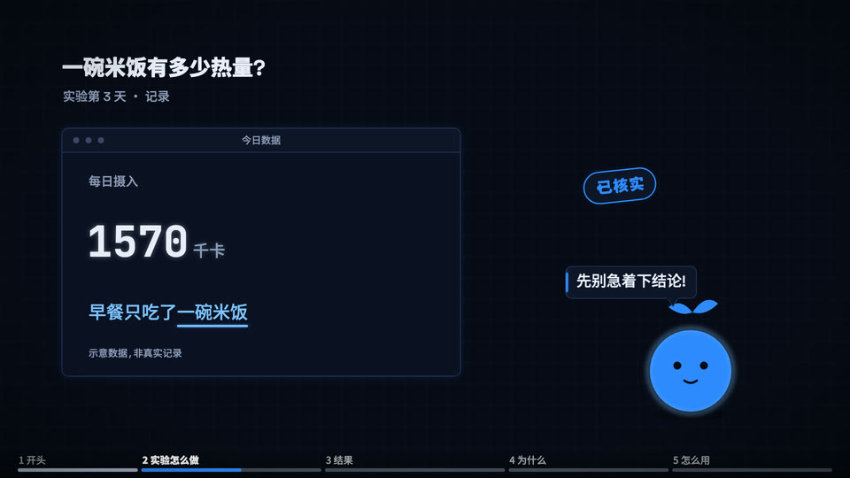
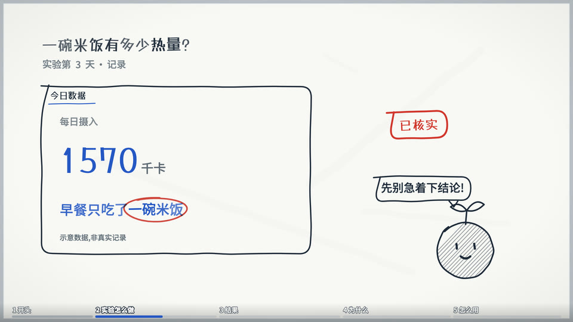
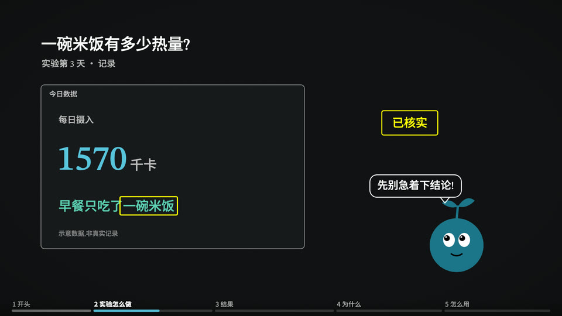
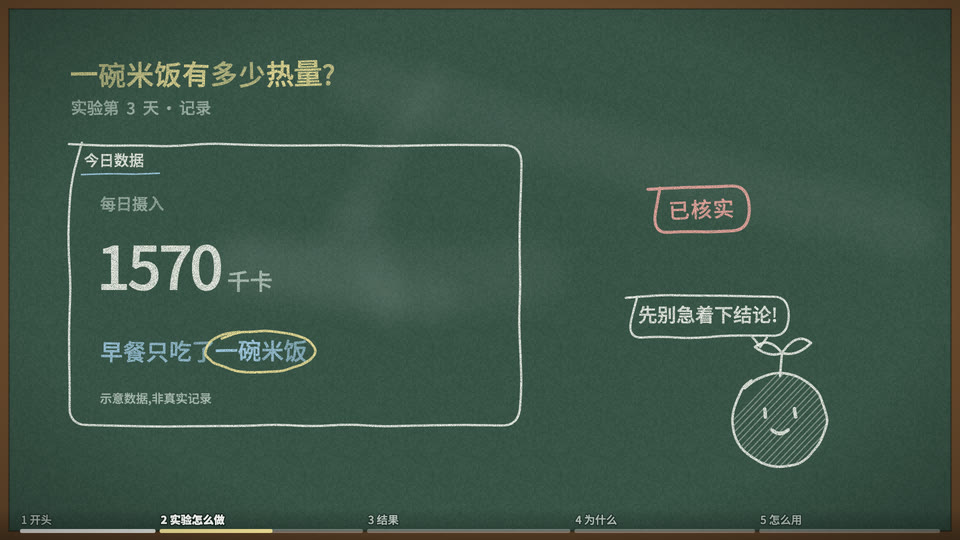
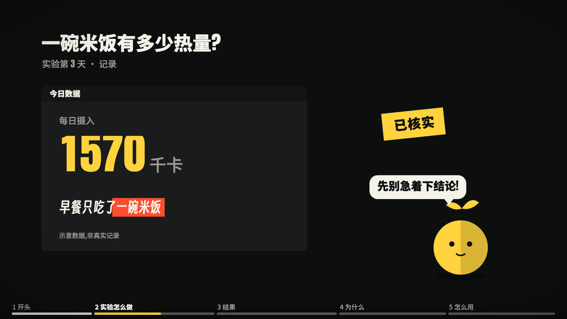

# Style library

中文:[INDEX.md](INDEX.md)

Style = **how it's drawn**: rendering language, materials, light, line, motion feel, how characters are drawn. Separate from "what world is drawn" (scenes, ../scenes/):
one style can draw many scenes (paper-skeuo draws both the case-file desk and the 1944 lab); one scene can switch styles (the case-file desk can be drawn flat).

| Thumbnail | id | Style | In one line | Scenes used in | Detailed in pure code? | Status |
|---|---|---|---|---|---|---|
|  | [paper-skeuo](paper-skeuo.en.md) | Paper skeuomorphic | Real paper, real ink, a real typewriter, a top-down desk | case files, 1944 lab, dashboard paper objects, paper lab notes, gallery labels | yes | full video ×5 |
|  | [game-ui](game-ui.en.md) | Game skeuomorphic | Game-quality panels + terrain materials | strategy game | yes (takes effort) | full video ×2 |
|  | [flat-geometric](flat-geometric.en.md) | Flat geometric | Outline-free two-tone fills, geometric diagrams | anatomy diagram | yes | full video ×1 |
|  | [flat-illustration](flat-illustration.en.md) | Flat illustration | The Kurzgesagt approach: depth, light, grain, a living landscape | side-scrolling landscape | backgrounds yes; characters need image generation | sample |
|  | [cartoon-ui](cartoon-ui.en.md) | Cartoon UI | Macaron colors, rounded thick outlines, hatched fills | editing desk, info cards | yes | full video ×3 |
|  | [tech-ui](tech-ui.en.md) | Dark tech UI | Deep blue-black, thin-line panels, blue glow, monospace numbers | tech terminal | yes | full video ×2 |
|  | [whiteboard](whiteboard.en.md) | Whiteboard | Marker line art drawn while talking, diagonal hatching, three pen colors | samples (info cards) | yes | samples (decision-maker reviewed 2026-10-07) |
|  | [dark-math](dark-math.en.md) | Dark math | The 3Blue1Brown approach: black background, color = concept, one object morphing continuously | samples (info cards) | yes | samples (decision-maker reviewed 2026-10-07) |
|  | [chalkboard](chalkboard.en.md) | Chalkboard | Dark green board, chalk handwriting letter by letter + grain, drawn while talking | samples (info cards) | yes | samples (decision-maker reviewed 2026-10-07: fine) |
|  | [kinetic](kinetic.en.md) | Kinetic type | The words are the actors: keywords fling in, slam down, pin; yellow + red-orange | samples (info cards) | yes | samples (awaiting the decision-maker) |

Candidate styles, the admission bar (three samples) and the update rhythm: [ROADMAP.md](ROADMAP.en.md).

**Thumbnails** (2026-10-07): the same scene (info cards), the same content, the same layout — only the style layer changes; all side by side in [thumbs/_all.jpg](thumbs/_all.jpg).
Generated by `engine/vc/thumbs.html` (`node engine/vc/thumbs.mjs`); the scene function only calls components and text roles, with no colors or fonts, so these ten together prove that "switching style = swapping one look in `engine/vc/styles.js`".
Note: thumbnails show the shared components' first-version looks, simpler than each style's full videos (no game terrain and fog, no illustrated skeleton characters, and the character is a uniform placeholder — a round body with a sprout on top, deliberately not any animal, since every channel has its own mascot); for a new style, add a look to `styles.js` and re-run.

## Judging: can pure code render it in detail?
The star is graphics (charts, UI, paper, maps, geometry) ⇒ yes; the star is a detailed character ⇒ hand it to a generated character (../characters/), with code doing motion and relighting.
[Capability limit 2026-10] The "detailed in pure code?" column reflects the models of the time; with a stronger model, re-test one style marked "no" before deciding whether to change it.

## Adding a style
1. Copy [_template.md](_template.en.md).
2. Required: rendering language, materials, font tendencies (pick from ../design/fonts.md), **how characters are drawn in this style** (code drawing / image-generation constraints / relighting parameters).
3. Register only after samples with an existing scene + a character.
